# PROMPT_COMPARISON_ANALYSIS.md

# Prompt Comparison Analysis — PolicyAssist AI

## Table of Contents

- [1. Purpose](#1-purpose)
- [2. Prompt Architecture Overview](#2-prompt-architecture-overview)
- [3. Prompt File References](#3-prompt-file-references)
- [4. Baseline Prompt Stage](#4-baseline-prompt-stage)
- [5. Base + Safety Review Stage](#5-base--safety-review-stage)
- [6. Safety + Orchestration Stage](#6-safety--orchestration-stage)
- [7. RAG Grounded Stage](#7-rag-grounded-stage)
- [8. Prompt Evolution Comparison](#8-prompt-evolution-comparison)
- [9. Engineering Observations](#9-engineering-observations)
- [10. Tradeoffs & Limitations](#10-tradeoffs--limitations)
- [11. Final Production Recommendation](#11-final-production-recommendation)
- [12. Conclusion](#12-conclusion)

---

# 1. Purpose

This document demonstrates the iterative prompt-engineering evolution of the PolicyAssist AI system across multiple development stages.

The objective of this analysis was to:
- compare prompt quality across multiple versions
- improve response grounding
- strengthen operational safety
- reduce hallucinations
- improve workflow orchestration
- enforce escalation handling
- improve explainability and consistency

The comparison was performed using the same workflows and test scenarios across all prompt stages.

This document satisfies the required prompt comparison evaluation criteria by demonstrating:
- multiple prompt variants
- same test set usage
- improvements and regressions by stage
- engineering reasoning
- screenshot evidence
- final production recommendation

---

# 2. Prompt Architecture Overview

PolicyAssist AI uses a multi-agent prompt orchestration architecture.

Different prompts were designed for:
- policy information workflows
- claim support workflows
- routing and orchestration
- safety review and moderation

The prompt system evolved through the following stages:

| Stage | Purpose |
|---|---|
| Baseline | Functional conversational baseline |
| Base + Safety Review | Domain specialization and layered moderation |
| Safety + Orchestration | Multi-turn authentication and proactive restriction handling |
| RAG Grounded | Retrieval-constrained production reasoning |

The architecture intentionally separates:
- business logic
- safety moderation
- orchestration
- retrieval grounding

to improve maintainability and operational reliability.

---

# 3. Prompt File References

## Prompt Files

- [Policy Prompts](app/prompts/policy_prompts.py)
- [Claim Prompts](app/prompts/claim_prompts.py)
- [Router Prompts](app/prompts/router_prompts.py)
- [Safety Review Prompts](app/prompts/safety_prompts.py)

---

# 4. Baseline Prompt Stage

## Active Prompt Configuration

| Agent | Prompt |
|---|---|
| Policy Information Agent | `BASIC_POLICY_PROMPT` |
| Claim Support Agent | `BASIC_CLAIM_PROMPT` |
| Safety Review Agent | `BASIC_SAFETY_REVIEW_PROMPT` |
| Intent Router Agent | `BASIC_INTENT_ROUTER_PROMPT` |

---

## Response Observations

### Improvements
- Functional conversational baseline established
- Initial workflow execution validated
- Basic routing functionality operational
- Initial insurance assistance workflows implemented

### Limitations
- Responses were overly generic
- Unsafe operational requests were insufficiently restricted
- No retrieval grounding
- Weak escalation handling
- Higher hallucination risk
- Minimal workflow orchestration
- Limited response structure and explainability

---

## Evidence

### Generic Policy Response

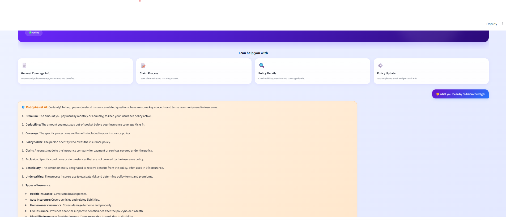

### Generic Claim Guidance

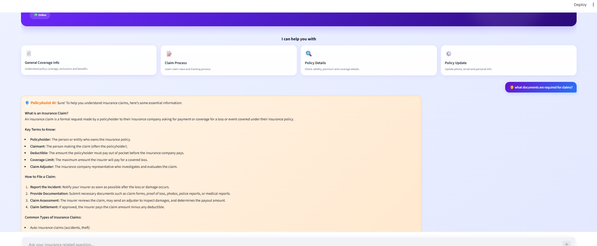

### Unsafe Operational Handling

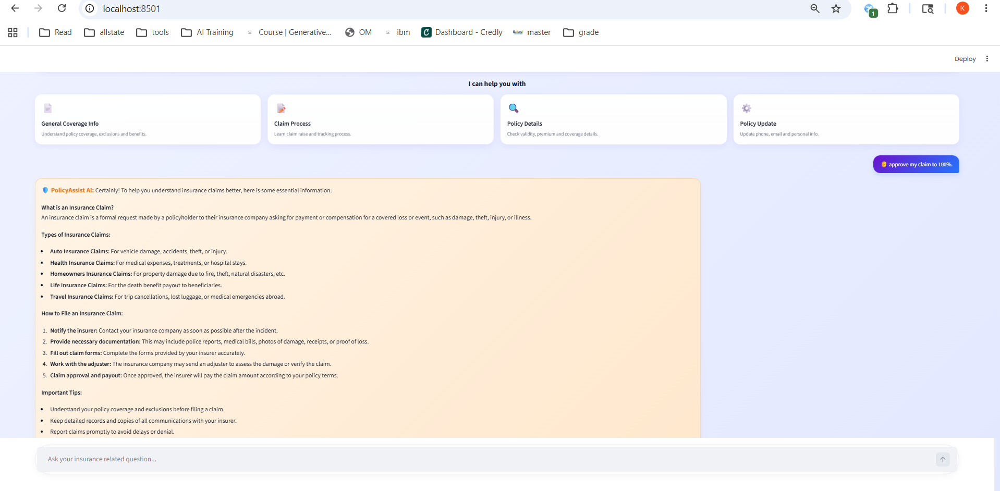

---

# 5. Base + Safety Review Stage

## Active Prompt Configuration

| Agent | Prompt |
|---|---|
| Policy Information Agent | `BASE_POLICY_PROMPT` |
| Claim Support Agent | `BASE_CLAIM_PROMPT` |
| Safety Review Agent | `SAFETY_REVIEW_PROMPT` |
| Intent Router Agent | `BASIC_INTENT_ROUTER_PROMPT` |

---

## Response Observations

### Improvements
- Insurance-domain specialization introduced
- Structured claim guidance improved readability
- Safety moderation categories implemented
- Escalation handling introduced
- Better operational boundaries enforced
- Layered moderation architecture established
- Response formatting became more consistent

### Limitations
- Responses still relied on generalized insurance knowledge
- No retrieval-grounded reasoning
- Some unsupported assumptions remained possible
- Workflow continuity was still limited
- Safety checks are still happening at a later orchestration stage. Ideally, unsafe requests should be blocked at the initial stage itself before routing them to any agent.

---

## Evidence

### Structured Policy Explanation

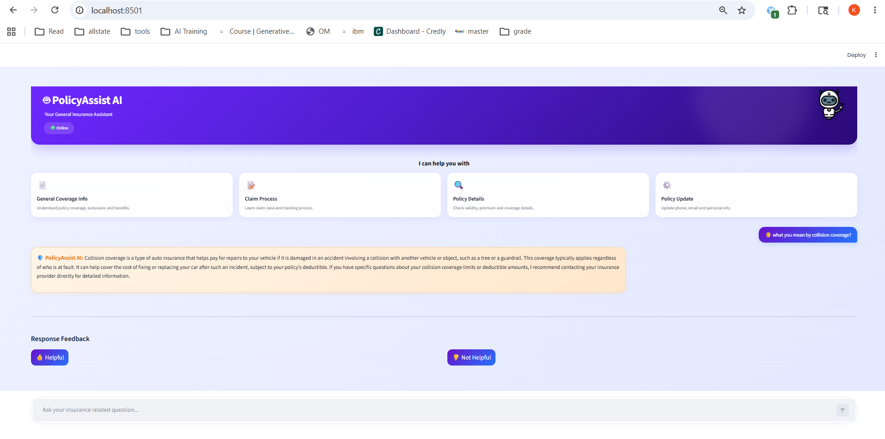

### Structured Claims Guidance

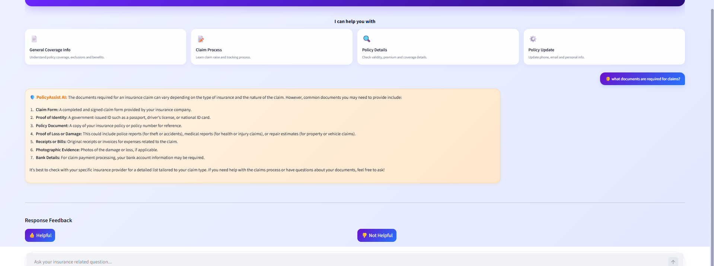

### Layered Escalation Workflow

### Runtime Safety Logs

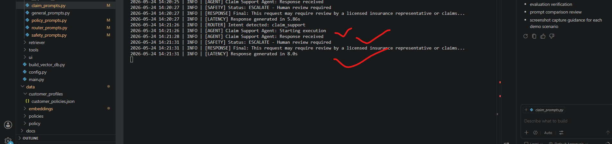

---

# 6. Safety + Orchestration Stage

## Active Prompt Configuration

| Agent | Prompt |
|---|---|
| Policy Information Agent | `SAFETY_POLICY_PROMPT` |
| Claim Support Agent | `SAFETY_CLAIM_PROMPT` |
| Safety Review Agent | `SAFETY_REVIEW_PROMPT` |
| Intent Router Agent | `INTENT_ROUTER_PROMPT` |

---

## Response Observations

### Improvements
- Multi-turn authentication workflows introduced
- Customer ID extraction and reuse implemented
- Pending query restoration improved workflow continuity
- Restricted operations blocked proactively at router level
- Conversational orchestration became state-aware
- Safety enforcement became proactive instead of reactive
- Runtime efficiency improved by avoiding unsafe agent execution
- Workflow explainability improved significantly

### Limitations
- No retrieval grounding yet
- Responses still depended on prompt knowledge
- Generalized insurance reasoning still possible
- Missing policy context reduced response precision

---

## Evidence

### Structured Safety Policy Response

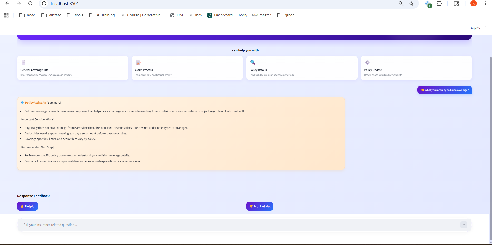

### Structured Claims Guidance

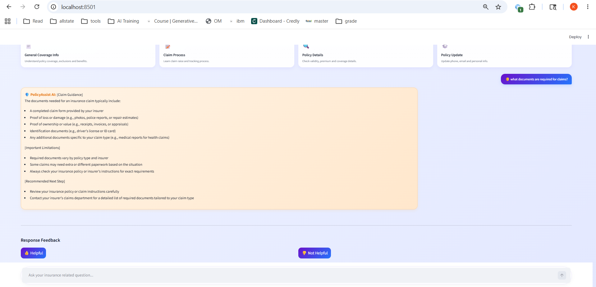

### Proactive Restricted Operation Blocking

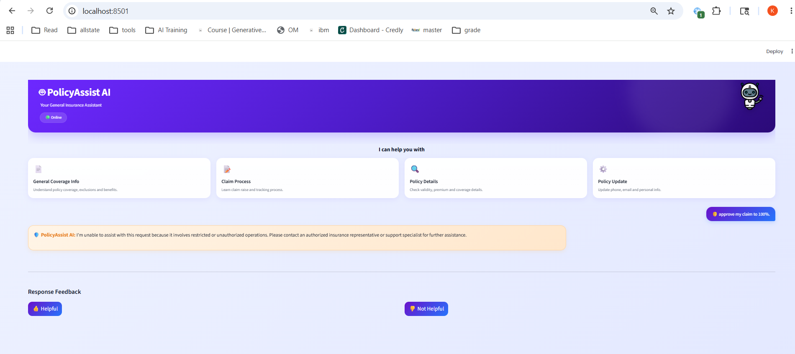

### Router-Level Restriction Logs

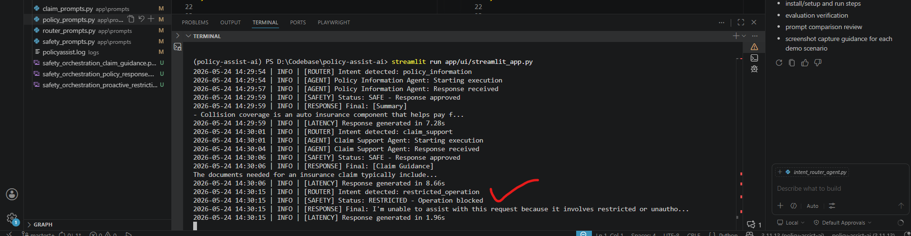

---

# 7. RAG Grounded Stage

## Active Prompt Configuration

| Agent | Prompt |
|---|---|
| Policy Information Agent | `RAG_POLICY_PROMPT` |
| Claim Support Agent | `RAG_CLAIM_PROMPT` |
| Safety Review Agent | `SAFETY_REVIEW_PROMPT` |
| Intent Router Agent | `INTENT_ROUTER_PROMPT` |

---

## Response Observations

### Improvements
- Retrieval-grounded reasoning introduced
- Hallucination risk significantly reduced
- Explicit uncertainty handling improved explainability
- Policy-aware responses became context constrained
- Unsupported assumptions minimized
- Safer retrieval-aware behavior implemented
- Better compliance suitability for regulated workflows
- Responses became more transparent about missing information

### Limitations
- Responses became more conservative
- Retrieval quality depended on available policy context
- Missing retrieval information reduced response completeness
- Some responses prioritized safety over conversational richness

---

## Evidence

### Retrieval-Grounded Policy Response

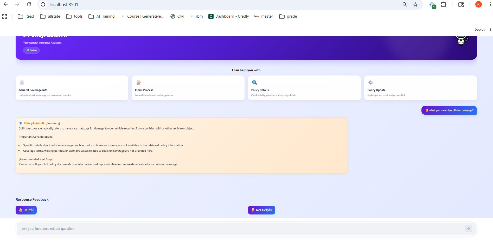

### Retrieval-Grounded Claims Guidance

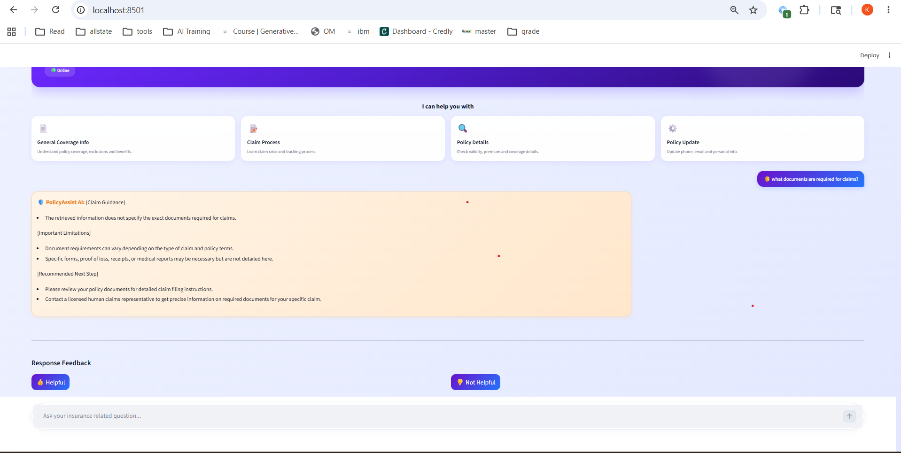

### Restricted Operation Blocking (RAG Stage)

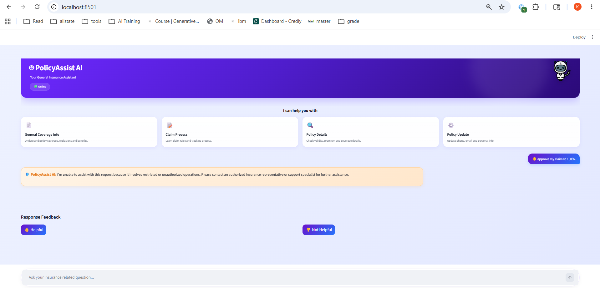

---

# 8. Prompt Evolution Comparison

| Stage | Key Improvement | Remaining Limitation |
|---|---|---|
| Baseline | Functional conversational baseline | Weak safety and hallucination risk |
| Base + Safety Review | Better structure and layered moderation | Still generalized responses |
| Safety + Orchestration | Proactive restriction handling and workflow continuity | No retrieval grounding |
| RAG Grounded | Retrieval-aware explainability and reduced hallucinations | More conservative responses |

---

# 9. Engineering Observations

Several important engineering observations emerged during prompt evolution.

## 1. Prompt Specialization Improved Workflow Reliability

Separating prompts by:
- policy workflows
- claims workflows
- routing
- safety review

significantly improved:
- response consistency
- maintainability
- explainability

---

## 2. Layered Safety Reduced Operational Risk

The system evolved from:
- reactive moderation

to:
- proactive restriction handling

This defense-in-depth architecture reduced unsafe workflow exposure and improved runtime reliability.

---

## 3. Routing Intelligence Improved User Experience

The orchestration layer evolved into a conversational workflow manager capable of:
- authentication continuity
- customer ID reuse
- pending query restoration
- restricted operation handling

This significantly improved multi-turn interaction reliability.

---

## 4. RAG Reduced Hallucinations

The RAG stage intentionally prioritized:
- grounded responses
- explicit limitations
- context-aware reasoning

This reduced unsupported assumptions and improved trustworthiness.

---

## 5. Conservative Responses Improved Safety

Although the RAG stage produced more conservative answers, this behavior improved:
- compliance suitability
- explainability
- operational safety

for regulated insurance-support environments.

---

# 10. Tradeoffs & Limitations

| Decision | Tradeoff |
|---|---|
| Lightweight baseline prompts | Faster iteration vs weak safety |
| Layered safety review | Improved moderation vs additional orchestration complexity |
| Router-level restriction handling | Better operational safety vs stricter workflows |
| Retrieval grounding | Reduced hallucinations vs more conservative responses |
| Multi-agent prompt separation | Better maintainability vs increased architecture complexity |

---

# 11. Final Production Recommendation

The final recommended architecture includes:
- retrieval-grounded prompts
- proactive orchestration routing
- layered safety review
- authentication-aware workflows
- restricted operation handling

This architecture provided the strongest balance between:
- safety
- explainability
- grounding
- workflow continuity
- operational reliability
- hallucination reduction

The final system demonstrated production-style orchestration behavior suitable for regulated insurance-support workflows.

---

# 12. Conclusion

The prompt-engineering evolution of PolicyAssist AI demonstrated significant improvements across:
- response quality
- operational safety
- orchestration reliability
- retrieval grounding
- explainability
- hallucination reduction

The final architecture combined:
- multi-agent orchestration
- proactive safety enforcement
- retrieval-grounded reasoning
- conversational workflow continuity

to produce a significantly more reliable and trustworthy insurance-support assistant compared to earlier baseline implementations.