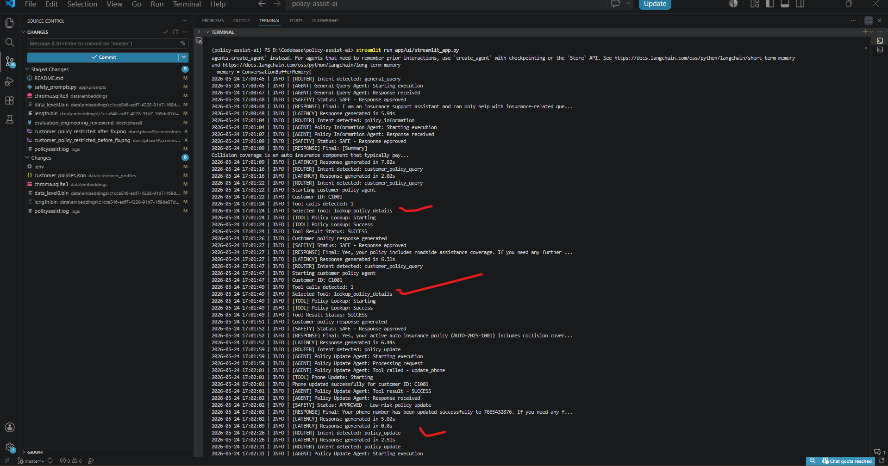

# PolicyAssist AI

PolicyAssist AI is a safety-first multi-agent insurance support assistant built using LangChain, OpenAI, ChromaDB, and Retrieval-Augmented Generation (RAG).

The system provides:
- policy information assistance
- claim guidance
- controlled policy updates
- retrieval-grounded responses
- layered safety enforcement
- workflow orchestration
- evaluation tooling
- Streamlit-based UI workflows

This project was developed as part of the Industry Capstone Project requirements for designing, building, evaluating, and justifying a production-oriented AI agent system. :contentReference[oaicite:0]{index=0}

---

# Table of Contents

- [1. Project Overview](#1-project-overview)
- [2. Features](#2-features)
- [3. Architecture Overview](#3-architecture-overview)
- [4. Tech Stack](#4-tech-stack)
- [5. Project Structure](#5-project-structure)
- [6. Setup Instructions](#6-setup-instructions)
- [7. Evaluation & Testing](#7-evaluation--testing)
- [8. Logs & Monitoring](#8-logs--monitoring)
- [9. Phase Documentation](#9-phase-documentation)
- [10. Final Submission Documents](#10-final-submission-documents)
- [11. Safety Features](#11-safety-features)
- [12. Known Limitations](#12-known-limitations)
- [13. Future Improvements](#13-future-improvements)
- [14. Conclusion](#14-conclusion)

---

# 1. Project Overview

PolicyAssist AI is a production-oriented insurance support assistant designed to:
- explain insurance policy information
- assist with claims guidance
- handle controlled operational workflows
- provide retrieval-grounded responses
- enforce safety restrictions
- support evaluation-driven development

The system combines:
- multi-agent orchestration
- Retrieval-Augmented Generation (RAG)
- layered safety enforcement
- workflow continuity
- runtime evaluation tooling

to improve reliability and explainability for regulated insurance workflows.

The project aligns with the Customer Support — AI Support Resolution Agent scenario requirements from the capstone project specification. :contentReference[oaicite:1]{index=1}

---

# 2. Features

- Multi-agent orchestration
- Retrieval-Augmented Generation (RAG)
- ChromaDB vector retrieval
- Streamlit web interface
- CLI interface
- Safety review workflows
- Restricted operation blocking
- Multi-turn authentication handling
- Evaluation harness
- Retrieval comparison testing
- Runtime logging
- Feedback tracking
- Conversation memory management
- Adaptive workflow handling
- Prompt comparison analysis
- Retrieval-grounded reasoning

---

# 3. Architecture Overview

PolicyAssist AI uses a modular multi-agent architecture consisting of:

- Intent Router Agent
- Policy Information Agent
- Claim Support Agent
- Customer Policy Agent
- Policy Update Agent
- Safety Review Agent
- Retrieval Layer (ChromaDB)
- Streamlit User Interface
- Evaluation Harness

The architecture separates:
- orchestration
- retrieval
- reasoning
- moderation

to improve:
- maintainability
- explainability
- workflow reliability
- safety enforcement

The system architecture evolved incrementally across all capstone phases:
- baseline agent
- prompt engineering
- retrieval integration
- tool usage
- memory and planning
- adaptive workflows
- deployment readiness
- evaluation engineering

---

# 4. Tech Stack

| Component | Technology |
|---|---|
| LLM Provider | OpenAI GPT |
| Framework | LangChain |
| Vector Database | ChromaDB |
| Frontend | Streamlit |
| Embeddings | OpenAI Embeddings |
| Backend Language | Python |
| Evaluation | Custom Evaluation Harness |
| Logging | Python Logging |
| Memory Handling | Session-based conversation memory |

---

# 5. Project Structure

```text
policyassist-ai/
│
├── .env_example                    # Example environment configuration template
├── .gitignore                      # Git ignored files and folders
├── .python-version                 # Python runtime version
├── .venv/                          # Local virtual environment
│
├── app/                            # Core application source code
│   ├── build_vector_db.py          # Builds ChromaDB vector database from policy documents
│   ├── config.py                   # Centralized application configuration
│   ├── main.py                     # CLI application entry point
│   │
│   ├── agents/                     # Multi-agent orchestration and workflow logic
│   │   ├── claim_support_agent.py          # Claim guidance agent
│   │   ├── customer_policy_agent.py        # Customer-specific policy query agent
│   │   ├── general_query_agent.py          # General insurance query handling
│   │   ├── intent_router_agent.py          # Intent detection and workflow orchestration
│   │   ├── policy_information_agent.py     # Policy information explanation agent
│   │   ├── policy_update_agent.py          # Policy update workflow agent
│   │   └── safety_review_agent.py          # Safety moderation and escalation agent
│   │
│   ├── evaluation/                 # Evaluation harness and testing workflows
│   │   ├── evaluation_results.json                 # Evaluation output metrics
│   │   ├── evaluation_test_cases.py                # Evaluation test scenarios
│   │   ├── retrieval_comparison_results.json       # RAG vs non-RAG comparison results
│   │   ├── run_evaluation.py                      # Main evaluation runner
│   │   └── run_retrieval_comparison.py            # Retrieval comparison evaluation runner
│   │
│   ├── feedback/                   # User feedback capture and storage
│   │   ├── feedback_log.json       # Stored user feedback records
│   │   └── feedback_utils.py       # Feedback utility helpers
│   │
│   ├── llm/                        # LLM integration layer
│   │   └── llm_client.py           # OpenAI LLM client wrapper
│   │
│   ├── logs/                       # Application logging utilities
│   │   └── logger.py               # Centralized logging configuration
│   │
│   ├── memory/                     # Conversation memory management
│   │   └── conversation_memory.py  # Session memory and reset handling
│   │
│   ├── prompts/                    # Prompt templates for all agents
│   │   ├── claim_prompts.py        # Claim workflow prompts
│   │   ├── general_prompts.py      # General assistant prompts
│   │   ├── policy_prompts.py       # Policy information prompts
│   │   ├── router_prompts.py       # Routing and orchestration prompts
│   │   └── safety_prompts.py       # Safety review and moderation prompts
│   │
│   ├── retriever/                  # Retrieval-Augmented Generation (RAG) pipeline
│   │   ├── document_loader.py      # Policy document ingestion
│   │   ├── retriever.py            # Retrieval orchestration
│   │   ├── text_splitter.py        # Text chunking utilities
│   │   └── vector_store.py         # ChromaDB vector storage integration
│   │
│   ├── tools/                      # Operational workflow tools
│   │   ├── policy_lookup_tool.py   # Customer policy lookup tool
│   │   ├── update_email_tool.py    # Email update simulation tool
│   │   ├── update_phone_tool.py    # Phone update simulation tool
│   │   └── utils.py                # Shared tool helper functions
│   │
│   └── ui/                         # User interface layer
│       └── streamlit_app.py        # Streamlit web application
│
├── data/                           # Policy and customer data storage
│   ├── customer_profiles/          # Customer policy datasets
│   │   └── customer_policies.json  # Sample customer policy records
│   │
│   ├── embeddings/                 # Generated vector database storage
│   │   └── chroma.sqlite3          # ChromaDB SQLite persistence
│   │
│   ├── policies/                   # Insurance policy reference documents
│   │   ├── claim_process_info.txt          # Claim workflow information
│   │   ├── coverage_info.txt               # Policy coverage information
│   │   └── policy_update_process.txt       # Policy update process information
│   │
│   └── policy/                     # Additional vector database storage
│       └── embeddings/
│           └── chroma.sqlite3
│
├── docs/                           # Phase-wise project documentation
│   ├── phase1/                     # Problem framing and system design
│   ├── phase2/                     # Baseline agent implementation
│   ├── phase3/                     # Prompt engineering experiments
│   ├── phase4/                     # RAG implementation
│   ├── phase5/                     # Tool integration
│   ├── phase6/                     # Memory and planning workflows
│   ├── phase7/                     # Adaptive behaviour implementation
│   ├── phase8/                     # Deployment readiness and monitoring
│   └── phase9/                     # Evaluation and engineering review
│
├── logs/                           # Runtime-generated application logs
│
├── screenshots/                    # Screenshots used for evaluation and submission evidence
│
├── ENGINEERING_AND_PRODUCT_JUSTIFICATION.md     # Engineering decisions and tradeoff analysis
├── FINAL_DEMO_SCRIPT.md                    # Demo scenarios and evaluator workflows
├── PROMPT_COMPARISON_ANALYSIS.md           # Prompt evolution and comparison analysis
├── pyproject.toml                          # Python project configuration
├── README.md                               # Project overview and evaluator guide
└── requirements.txt                        # Python dependency requirements
```

---

# 6. Setup Instructions

## Clone Repository

```bash
git clone <repository-url>
cd policyassist-ai
```


## Create Vertual ENV

```bash
pip venv
.venv\Scripts\activate
```

## Install Dependencies

```bash
pip install -r requirements.txt
```

## Configure Environment Variables

Update `.env`:

```env
OPENAI_API_KEY=
OPENAI_MODEL=
```

## Build Retrieval Database

```bash
python app/build_vector_db.py
```

## Run CLI Application

```bash
python app/main.py
```

## Run Streamlit UI

```bash
streamlit run app/ui/streamlit_app.py
```

---

# 7. Evaluation & Testing

## Run Evaluation Harness

```bash
python app/evaluation/run_evaluation.py
```

## Run Retrieval Comparison

```bash
python app/evaluation/run_retrieval_comparison.py
```

## Evaluation Output Files

- `app/evaluation/evaluation_results.json`
- `app/evaluation/retrieval_comparison_results.json`

The evaluation framework measures:
- response quality
- latency
- consistency
- retrieval grounding
- runtime failure handling
- workflow safety
- orchestration reliability

The evaluation stage aligns with the capstone evaluation requirements for:
- quality metrics
- failure analysis
- safety review
- engineering improvement planning :contentReference[oaicite:2]{index=2}

---

# 8. Logs & Monitoring

## Runtime Logs

```text
logs/policyassist.log
```

The logs include:
- routing decisions
- safety review results
- runtime latency
- orchestration traces
- evaluation activity
- runtime failure tracking

The deployment and monitoring implementation aligns with the capstone deployment readiness requirements. :contentReference[oaicite:3]{index=3}

---


# 9. Phase Documentation

| Stage | Description | Documentation |
|---|---|---|
| Phase 1 | Understand the Problem & Define Success | <a href="docs/phase1/problem_framing_and_system_design.md" target="_blank">View</a> |
| Phase 2 | Build a Basic Working Multi Agent | <a href="docs/phase2/baseline_agent.md" target="_blank">View</a> |
| Phase 3 | LLM Integration, Prompt Engineering & Comparisons | <a href="docs/phase3/prompt_comparison.md" target="_blank">View</a> |
| Phase 4 | Retrieval-Augmented Generation (RAG) Integration | <a href="docs/phase4/rag_implementation.md" target="_blank">View</a> |
| Phase 5 | Tool Integration & Workflow Orchestration | <a href="docs/phase5/tool_usage.md" target="_blank">View</a> |
| Phase 6 | Planning, Memory & Context | <a href="docs/phase6/conversation_examples.md" target="_blank">View</a> |
| Phase 7 | Adaptive Behaviour | <a href="docs/phase7/adaptive_behaviour.md" target="_blank">View</a> |
| Phase 8 | Streamlit UI & Deployment Improvements | <a href="docs/phase8/deployment_readiness.md" target="_blank">View</a> |
| Phase 9 | Evaluation & Engineering Review | <a href="docs/phase9/evaluation_engineering_review.md" target="_blank">View</a> |
---

# 10. Evidence Walkthrough

Two consolidated evidence walkthrough PDFs are included to help evaluators quickly verify:
- retrieval grounding
- orchestration workflows
- safety enforcement
- evaluation tooling
- runtime logging
- tool execution
- memory workflows
- Streamlit interaction
- CLI execution

## Streamlit Workflow Evidence

[PolicyAssist_AI_Streamlit_Evidence.pdf](screenshots/PolicyAssist_AI_Streamlit_Evidence.pdf)

Covers:
- Streamlit UI workflows
- policy retrieval
- claims guidance
- memory workflows
- reset functionality
- safety enforcement
- evaluation screenshots

## Console & Runtime Logs Evidence



Covers:
- routing logs
- safety review logs
- orchestration traces
- evaluation execution
- retrieval comparison execution
- runtime recovery
- tool execution traces
- latency tracking
- debugging evidence

# 10. Final Submission Documents

| Document | Purpose |
|---|---|
| [PROMPT_COMPARISON_ANALYSIS.md](PROMPT_COMPARISON_ANALYSIS.md) | Prompt evolution, safety improvements, and RAG comparison |
| [FINAL_DEMO_SCRIPT.md](FINAL_DEMO_SCRIPT.md) | Forced interaction demo scenarios and screenshots |
| [ENGINEERING_AND_PRODUCT_JUSTIFICATION.md](ENGINEERING_AND_PRODUCT_JUSTIFICATION.md) | Engineering decisions, tradeoffs, and architecture justification |
| [docs/phase1/problem_framing.md](docs/phase1/problem_framing.md) | Problem framing and workflow definition |
| [docs/phase9/evaluation_engineering_review.md](docs/phase9/evaluation_engineering_review.md) | Evaluation metrics, failure analysis, and improvement roadmap |

These documents collectively satisfy the final capstone submission requirements. :contentReference[oaicite:4]{index=4}

---

# 11. Safety Features

PolicyAssist AI includes multiple safety-focused engineering controls:

- Restricted operation blocking
- Layered safety review
- Escalation handling
- Retrieval-grounded responses
- Explicit uncertainty communication
- Proactive router-level restriction handling
- Authentication-aware workflows
- Runtime safety logging
- Controlled operational workflows

Restricted operations include:
- claim approval requests
- reimbursement guarantees
- deductible waivers
- unauthorized policy modifications
- unsafe operational actions

The system was intentionally designed to:
- avoid hallucinated policies
- avoid unsafe approvals
- avoid unauthorized actions
- escalate sensitive workflows appropriately

These safeguards align with the Customer Support safety requirements defined in the capstone project specification. :contentReference[oaicite:5]{index=5}

---

# 12. Known Limitations

- Retrieval quality depends on available policy documents
- RAG responses may become conservative when context is insufficient
- Keyword-based evaluation is less robust than semantic scoring
- Local deployment architecture is not optimized for large-scale production traffic
- Streamlit provides limited frontend customization compared to enterprise frontend frameworks
- ChromaDB local storage is not designed for distributed production scaling

---

# 13. Future Improvements

- Semantic evaluation scoring
- Improved retrieval ranking
- Async orchestration
- Advanced memory personalization
- Enterprise authentication integration
- Improved PII masking
- Observability dashboards
- Cloud-native deployment architecture
- Multilingual support
- Enterprise vector database integration

---

# 14. Conclusion

PolicyAssist AI demonstrates a safety-first, retrieval-grounded, multi-agent insurance support architecture designed for:
- explainability
- workflow reliability
- operational safety
- evaluation-driven engineering

The project combines:
- LangChain orchestration
- Retrieval-Augmented Generation (RAG)
- layered moderation
- conversational workflow management
- evaluation tooling

to create a production-oriented insurance support assistant suitable for regulated workflow environments.

The project demonstrates:
- retrieval integration
- tool usage
- memory workflows
- adaptive behaviour
- evaluation engineering
- safety enforcement
- deployment readiness

