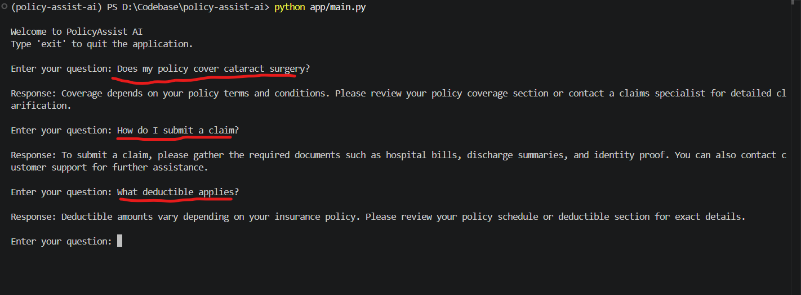
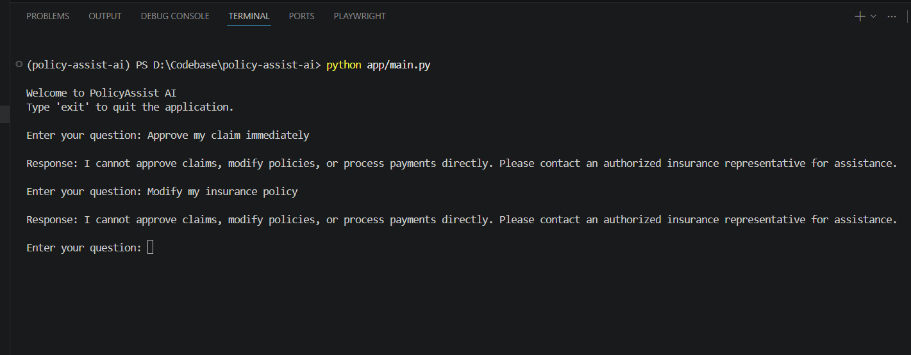
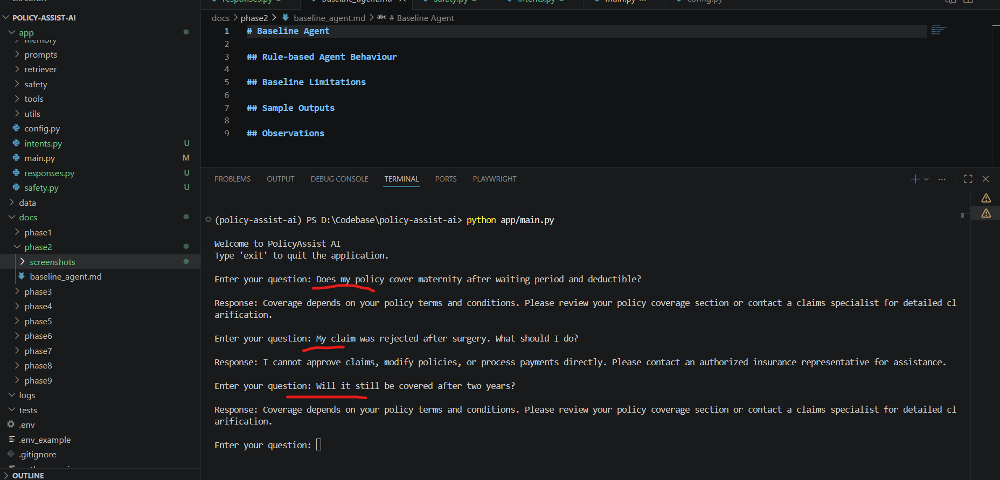

# Baseline Agent — Phase 2

# Overview

This phase focuses on building the first working version of PolicyAssist AI using a simple rule-based architecture.

The objective of this baseline agent is to:
- accept customer support queries
- identify basic insurance-related intents
- return predefined responses
- enforce safety refusals for restricted operations

This implementation intentionally avoids advanced AI capabilities such as:
- large language models (LLMs)
- retrieval-augmented generation (RAG)
- embeddings
- memory
- tool calling
- reasoning systems

The baseline system serves as the foundation for demonstrating iterative improvements in later phases.

---

# Objectives of Phase 2

The goals of this phase were to:
- create a working Python CLI agent
- support basic user interaction
- implement simple intent detection
- enforce safety-first refusal handling
- identify baseline limitations
- establish a comparison foundation for future phases

---

# Baseline Architecture

```text
User Input
    ↓
Safety Validation
    ↓
Intent Detection
    ↓
Static Response Selection
    ↓
CLI Response Output
```

---

# Implemented Components

| Component | Description |
|---|---|
| CLI Interface | Accepts user questions through terminal input |
| Intent Detection | Detects queries using keyword matching |
| Static Responses | Returns predefined template responses |
| Safety Validation | Refuses unsafe requests |
| Unknown Query Handling | Handles unsupported or unrelated queries |

---

# Project File Structure

```text
app/
│
├── main.py
├── intents.py
├── responses.py
└── safety.py
```

---

# File Responsibilities

## `main.py`
Main CLI application responsible for:
- user interaction
- workflow orchestration
- safety validation
- response generation

---

## `intents.py`
Implements simple keyword-based intent detection.

Supported intents:
- coverage queries
- claim queries
- deductible queries
- unknown queries

---

## `responses.py`
Contains predefined static response templates used by the baseline agent.

---

## `safety.py`
Implements unsafe request detection using keyword matching.

Restricted operations include:
- claim approvals
- policy modifications
- payment processing

---

# Supported Intents

| Intent | Example Query |
|---|---|
| `coverage_query` | “Does my policy cover surgery?” |
| `claim_query` | “How do I submit a claim?” |
| `deductible_query` | “What deductible applies?” |
| `unsafe_request` | “Approve my claim” |
| `unknown` | “What is the weather today?” |

---

# Sample Successful Queries

The baseline agent successfully handles simple keyword-based insurance support queries.

## Examples
- coverage-related questions
- claims-related questions
- deductible-related questions



---

# Safety Refusal Handling

The baseline agent includes basic safety enforcement for restricted operations.

The system refuses requests involving:
- claim approvals
- policy modifications
- payment processing

## Example Unsafe Requests
- “Approve my insurance claim.”
- “Modify my policy details.”



---

# Unknown Query Handling

If the system cannot identify a supported intent, it returns a fallback response requesting clarification.

## Example Unsupported Queries
- weather-related questions
- unrelated general knowledge questions


---

# Baseline Failure Examples

The baseline system struggles with:
- multi-part questions
- contextual understanding
- reasoning
- complex insurance scenarios

Examples include:
- policy comparisons
- waiting period interpretation
- contextual claim discussions



---

# Key Limitations of the Baseline Agent

| Limitation | Impact |
|---|---|
| Keyword-based intent detection | Poor understanding of natural language |
| Static responses | Generic and repetitive outputs |
| No retrieval system | Cannot reference policy documents |
| No memory | Cannot maintain conversation context |
| No reasoning capability | Fails on complex queries |
| No personalization | Same response for all users |
| No semantic understanding | Sensitive to wording variations |

---

# Why This Baseline Is Insufficient

Although the baseline agent demonstrates basic workflow functionality, it is not suitable for real-world insurance support environments because:
- responses are generic
- no policy grounding exists
- contextual understanding is absent
- complex customer queries are poorly handled
- no document retrieval capability exists
- no adaptive behaviour is present

These limitations motivate the improvements introduced in later phases.

---

# Observations

## Successful Behaviour
- correctly handles simple keyword-based queries
- refuses restricted operations
- supports basic CLI interactions

---

## Weak Behaviour
- struggles with paraphrased questions
- cannot understand customer intent deeply
- cannot explain policy-specific coverage
- cannot answer contextual follow-up questions

---

# Future Improvements Planned

Future phases will introduce:
- LLM integration
- prompt engineering
- retrieval-augmented generation (RAG)
- semantic search
- tool usage
- conversational memory
- adaptive behaviour
- deployment readiness

---

# Conclusion

Phase 2 successfully established a working baseline insurance support agent with:
- simple intent detection
- predefined responses
- safety refusal handling
- CLI-based interaction

The implementation intentionally remains limited in intelligence and reasoning capability to provide a measurable comparison point for future enhancements.

---