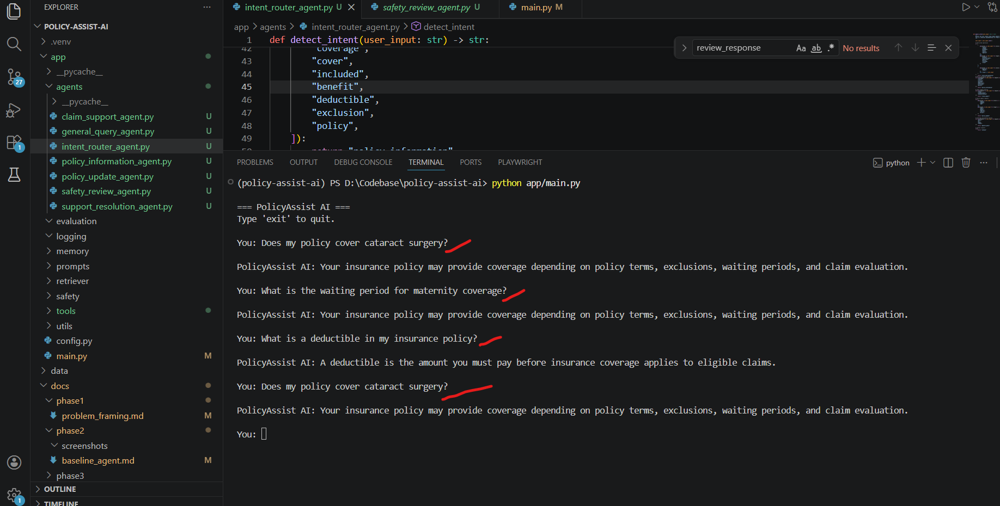
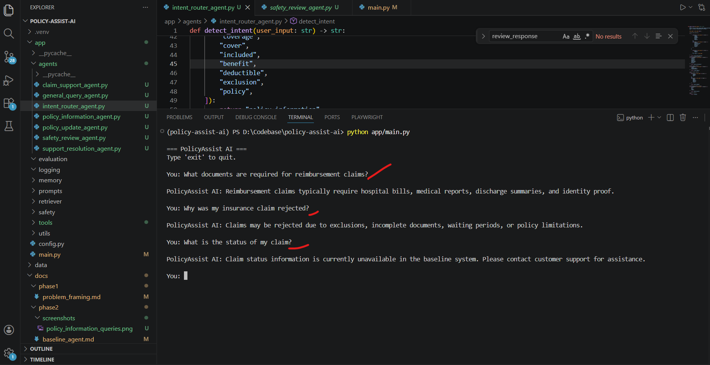
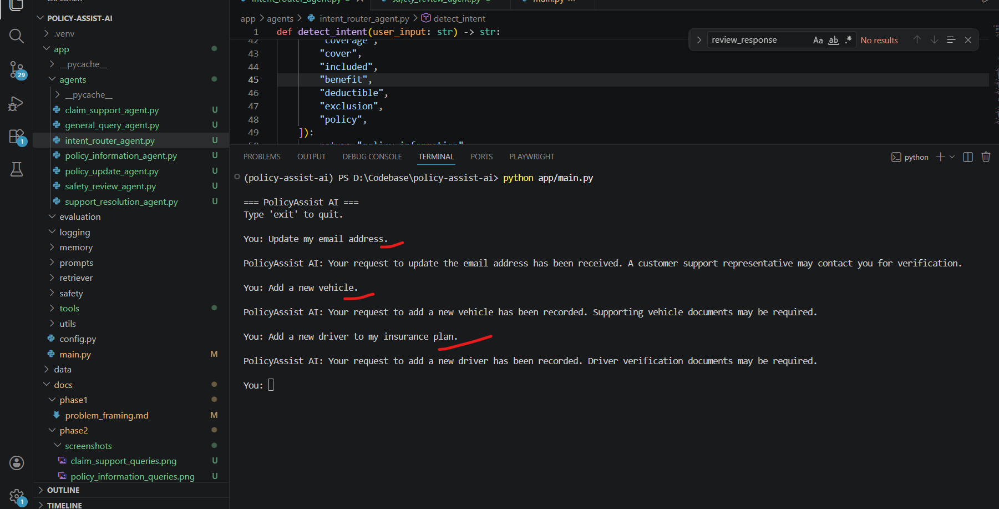
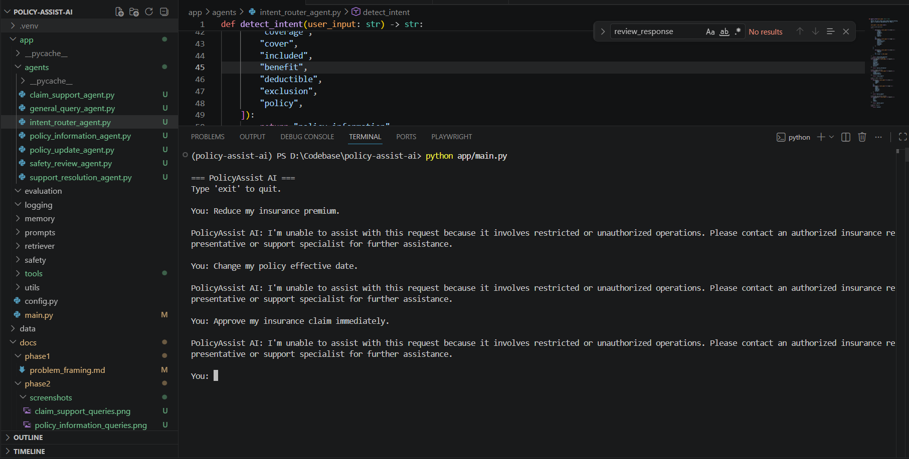
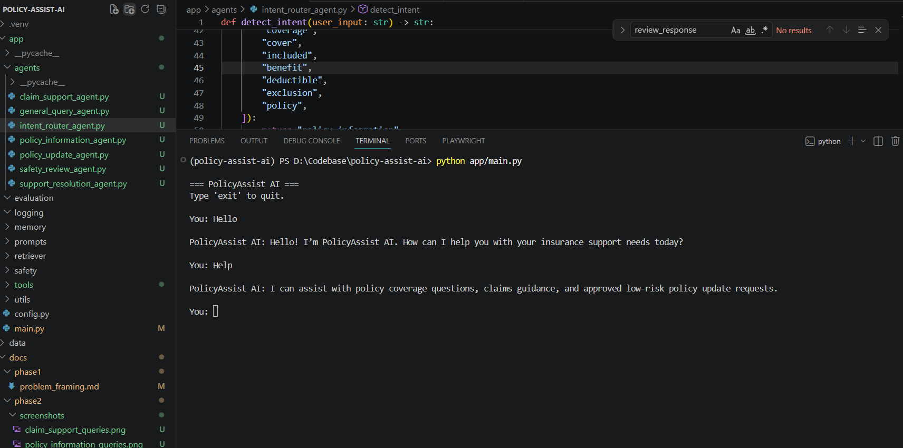
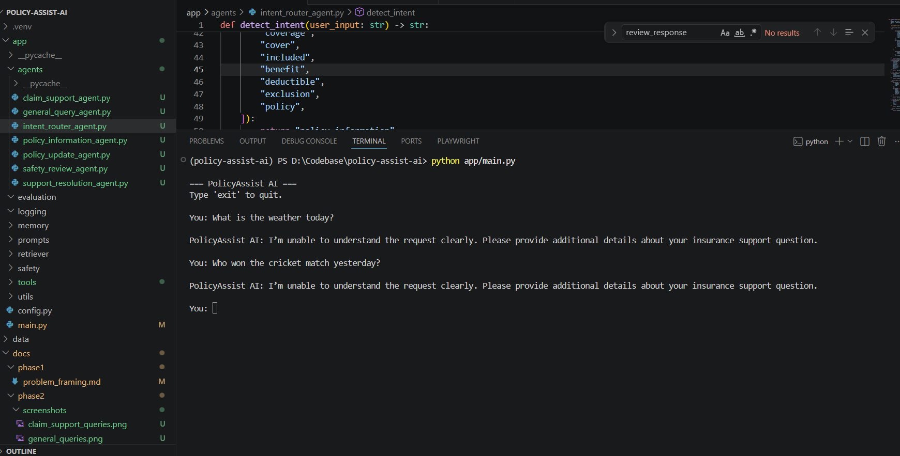

# Baseline Multi-Agent Agent — Phase 2

# Overview

This phase focuses on building the first working baseline version of PolicyAssist AI using a lightweight orchestrated multi-agent architecture.

The objective of this implementation is to:
- support insurance customer interactions
- classify customer requests
- route workflows to domain-specific agents
- enforce operational safety boundaries
- demonstrate baseline workflow orchestration

This implementation intentionally avoids advanced AI capabilities such as:
- large language models (LLMs)
- retrieval-augmented generation (RAG)
- semantic embeddings
- vector databases
- conversational memory
- tool execution
- adaptive reasoning

The baseline system establishes the architectural foundation for future intelligent capabilities introduced in later phases.

---

# Objectives of Phase 2

The goals of this phase were to:
- create a Python-based multi-agent CLI application
- implement intent-based workflow routing
- separate responsibilities into domain-specific agents
- enforce restricted operation handling
- demonstrate baseline workflow orchestration
- identify architectural and reasoning limitations

---

# Baseline Multi-Agent Architecture

```text
Customer Query
      ↓
Intent Router Agent
      ↓
──────────────────────────────────────────────
│                │                │
↓                ↓                ↓
Policy Info      Claim            Policy
Agent            Support          Update
                 Agent            Agent
│
└────────────────────┬───────────────────────┘
                     ↓
            General Query Agent
                     ↓
            Safety Review Agent
                     ↓
             Final Safe Response
```

---

# Multi-Agent Responsibilities

| Agent | Responsibility |
|---|---|
| Intent Router Agent | Detects intent and routes workflows |
| Policy Information Agent | Handles coverage and policy questions |
| Claim Support Agent | Handles claims guidance workflows |
| Policy Update Agent | Handles approved low-risk update requests |
| General Query Agent | Handles greetings and unsupported requests |
| Safety Review Agent | Validates responses and restricted operations |

---

# Implemented Components

| Component | Description |
|---|---|
| CLI Interface | Accepts customer support queries |
| Intent Routing | Detects workflow category using rule-based logic |
| Multi-Agent Workflow | Routes requests to dedicated domain agents |
| Safety Validation | Blocks restricted operations |
| Operational Support | Handles low-risk update requests |
| Unknown Query Handling | Handles unsupported requests gracefully |

---

# Project File Structure

```text
app/
│
├── main.py
│
├── agents/
│   ├── intent_router_agent.py
│   ├── policy_information_agent.py
│   ├── claim_support_agent.py
│   ├── policy_update_agent.py
│   ├── general_query_agent.py
│   └── safety_review_agent.py
```

---

# File Responsibilities

## `main.py`

Main orchestration workflow responsible for:
- routing requests
- coordinating agent execution
- applying safety review
- returning final responses

---

## `intent_router_agent.py`

Responsible for:
- intent detection
- workflow classification
- restricted operation identification

This implementation uses:
- rule-based keyword matching
- simple workflow routing logic

---

## `policy_information_agent.py`

Handles:
- policy coverage questions
- deductible explanations
- waiting period clarification
- exclusion guidance

This agent will later evolve into:
- a RAG-enabled retrieval agent

---

## `claim_support_agent.py`

Handles:
- claims guidance
- reimbursement support
- rejection explanations
- claims-related workflows

Future phases will add:
- retrieval support
- claim tools
- contextual reasoning

---

## `policy_update_agent.py`

Handles approved low-risk customer operations:
- email updates
- phone updates
- address updates
- add vehicle requests
- add driver requests

Current implementation uses:
- simulated operational responses

---

## `general_query_agent.py`

Handles:
- greetings
- help requests
- unsupported questions
- fallback responses

---

## `safety_review_agent.py`

Responsible for:
- restricted operation refusal
- response validation
- centralized safety enforcement

---

# Supported Workflow Types

| Workflow | Example Query |
|---|---|
| Policy Information | “Does my policy cover cataract surgery?” |
| Claim Support | “What documents are required for reimbursement claims?” |
| Policy Updates | “Update my email address.” |
| Restricted Requests | “Reduce my insurance premium.” |
| General Queries | “Hello” |
| Unknown Queries | “What is the weather today?” |

---

# Policy Information Queries

The baseline system supports:
- policy coverage explanations
- waiting period clarification
- deductible explanations
- exclusion guidance

## Screenshot Evidence



---

# Claim Support Queries

The baseline system supports:
- reimbursement guidance
- claims documentation assistance
- claim rejection explanations
- hospitalization guidance

## Screenshot Evidence



---

# Policy Update Requests

The baseline system supports approved low-risk operations such as:
- updating email address
- updating phone number
- updating address
- adding vehicles
- adding drivers

These operations are simulated in the baseline implementation.

## Screenshot Evidence



---

# Restricted Operations

The baseline system refuses high-risk operations such as:
- premium reduction requests
- policy effective date changes
- claim approvals
- deductible waivers
- policy cancellation requests

## Screenshot Evidence



---

# General Queries

The baseline system supports:
- greetings
- help requests
- simple conversational interactions

## Screenshot Evidence



---

# Unknown Query Handling

Unsupported or unrelated queries are handled using fallback responses requesting clarification.

## Screenshot Evidence



---

# Key Limitations of the Baseline System

| Limitation | Impact |
|---|---|
| Rule-based routing | Poor semantic understanding |
| Keyword dependency | Fragile query detection |
| Static responses | Generic customer responses |
| No retrieval system | Cannot reference policy documents |
| No memory | No multi-turn context handling |
| No tool execution | Operations are simulated only |
| No reasoning capability | Weak handling of complex workflows |
| No personalization | Same responses for all customers |

---

# Why This Baseline Is Insufficient

Although the baseline architecture demonstrates:
- workflow orchestration
- domain separation
- safety enforcement
- modular design

it is still insufficient for real-world insurance operations because:
- responses are generic
- no retrieval grounding exists
- no semantic understanding exists
- no conversational memory exists
- operations are simulated only
- no intelligent reasoning capability exists

These limitations motivate the improvements introduced in later phases.

---

# Observations

## Successful Behaviour

The baseline system successfully demonstrates:
- modular multi-agent orchestration
- domain-based workflow routing
- restricted operation refusal
- low-risk operational assistance
- CLI-based workflow interaction

---

## Weak Behaviour

The baseline system struggles with:
- paraphrased customer requests
- ambiguous workflows
- contextual understanding
- complex policy interpretation
- long multi-turn conversations

---

# Future Improvements Planned

Future phases will progressively evolve the baseline system into an enterprise-grade intelligent insurance support platform.

Planned improvements include:
- LLM integration
- prompt engineering
- retrieval-augmented generation (RAG)
- semantic search
- operational tool execution
- conversational memory
- adaptive behaviour
- deployment readiness
- evaluation frameworks

---

# Conclusion

Phase 2 successfully established a lightweight orchestrated multi-agent baseline architecture for PolicyAssist AI.

The implementation demonstrates:
- modular workflow orchestration
- domain-based agent separation
- safety-first operational boundaries
- restricted operation enforcement
- low-risk operational support

while intentionally preserving:
- weak reasoning
- static responses
- rule-based routing
- retrieval limitations

to provide a measurable foundation for future intelligent enhancements.

---