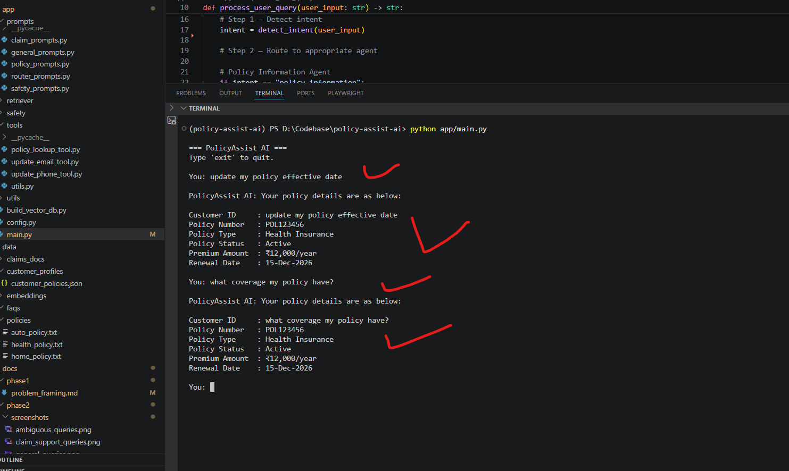
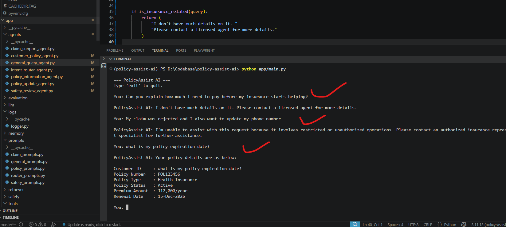

# Baseline Multi-Agent Agent — Phase 2

# Table of Contents

- [1. Overview](#1-overview)
- [2. Objectives](#2-objectives)
- [3. Baseline Multi-Agent Architecture](#3-baseline-multi-agent-architecture)
- [4. Multi-Agent Responsibilities](#4-multi-agent-responsibilities)
- [5. Project Structure](#5-project-structure)
- [6. Main Orchestration Workflow](#6-main-orchestration-workflow)
- [7. Intent Router Agent](#7-intent-router-agent)
- [8. Policy Information Agent](#8-policy-information-agent)
- [9. Customer Policy Agent](#9-customer-policy-agent)
- [10. Claim Support Agent](#10-claim-support-agent)
- [11. Policy Update Agent](#11-policy-update-agent)
- [12. General Query Agent](#12-general-query-agent)
- [13. Safety Review Agent](#13-safety-review-agent)
- [14. Baseline Limitations](#14-baseline-limitations)
- [15. Why This Baseline Is Insufficient](#15-why-this-baseline-is-insufficient)
- [16. Planned Improvements](#16-planned-improvements)
- [17. Conclusion](#17-conclusion)

---

# 1. Overview

This phase focuses on building the first working baseline version of PolicyAssist AI using a lightweight orchestrated multi-agent architecture.

The system supports:
- insurance workflow routing
- policy information support
- claims guidance
- low-risk operational requests
- fallback handling
- centralized safety validation

The baseline intentionally avoids advanced AI capabilities such as:
- Large Language Models (LLMs)
- Retrieval-Augmented Generation (RAG)
- semantic embeddings
- vector databases
- conversational memory
- semantic reasoning
- backend integrations

This creates a measurable baseline for future intelligent enhancements.

---

# 2. Objectives

The goals of this phase were to:
- build a Python-based multi-agent CLI system
- implement rule-based workflow routing
- separate workflows into domain-specific agents
- enforce restricted operation handling
- demonstrate baseline orchestration
- identify system limitations

---

# 3. Baseline Multi-Agent Architecture

```text
                         Customer Query
                                │
                                ▼
                    ┌─────────────────────┐
                    │ Intent Router Agent │
                    └─────────────────────┘
                                │
        ┌──────────────┬────────┼────────┬──────────────┬──────────────┐
        │              │        │        │              │              │
        ▼              ▼        ▼        ▼              ▼              ▼
┌──────────────┐ ┌───────────┐ ┌──────────────┐ ┌──────────────┐ ┌──────────────┐
│ Policy Info  │ │ Customer  │ │ Claim Support│ │ Policy Update│ │ General Query│
│ Agent        │ │ Policy    │ │ Agent        │ │ Agent        │ │ Agent        │
└──────────────┘ │ Agent     │ └──────────────┘ └──────────────┘ └──────────────┘
                 └───────────┘
        └──────────────┬────────┴────────┬──────────────┬──────────────┘
                       │
                       ▼
                ┌─────────────────────┐
                │ Safety Review Agent │
                └─────────────────────┘
                               │
                               ▼
                    Final Safe Response
```

---

# 4. Multi-Agent Responsibilities

| Agent | Responsibility |
|---|---|
| Intent Router Agent | Detects intent and routes workflows |
| Policy Information Agent | Handles general insurance explanations |
| Customer Policy Agent | Handles customer-specific policy queries |
| Claim Support Agent | Handles claims guidance workflows |
| Policy Update Agent | Handles approved low-risk updates |
| General Query Agent | Handles unsupported and non-insurance queries |
| Safety Review Agent | Enforces centralized safety validation |

---

# 5. Project Structure

```text
app/
│
├── main.py
│
├── agents/
│   ├── claim_support_agent.py
│   ├── customer_policy_agent.py
│   ├── general_query_agent.py
│   ├── intent_router_agent.py
│   ├── policy_information_agent.py
│   ├── policy_update_agent.py
│   └── safety_review_agent.py
```

---

# 6. Main Orchestration Workflow

## `main.py`

The `main.py` file acts as the orchestration layer for the baseline multi-agent insurance support system.

Responsibilities:
- accept user queries
- detect workflow intent
- route requests to agents
- apply centralized safety validation
- return final responses

## Full Implementation

```python
from agents.intent_router_agent import detect_intent
from agents.policy_information_agent import handle_policy_information_query
from agents.claim_support_agent import handle_claim_support_query
from agents.policy_update_agent import handle_policy_update_request
from agents.general_query_agent import handle_general_query
from agents.customer_policy_agent import handle_customer_policy_query
from agents.safety_review_agent import review_response


def process_user_query(user_input: str) -> str:

    intent = detect_intent(user_input)

    if intent == "policy_information":
        response = handle_policy_information_query(user_input)

    elif intent == "customer_policy_query":
        response = handle_customer_policy_query(user_input)

    elif intent == "claim_support":
        response = handle_claim_support_query(user_input)

    elif intent == "policy_update":
        response = handle_policy_update_request(user_input)

    elif intent == "restricted_operation":
        response = "Restricted operation detected."

    else:
        response = handle_general_query(user_input)

    safe_response = review_response(intent, response)

    return safe_response
```

---

# 7. Intent Router Agent

## `intent_router_agent.py`

The router detects workflow intent using:
- keyword matching
- static rules
- conditional routing logic

## Full Implementation

```python
def detect_intent(user_input: str) -> str:

    user_input = user_input.lower()

    # Restricted operations
    if (
        (
            any(action in user_input for action in [
                "reduce",
                "change",
                "backdate",
                "waive",
                "cancel",
                "approve"
            ])
            and
            any(target in user_input for target in [
                "premium",
                "effective date",
                "deductible",
                "policy",
                "coverage",
                "claim"
            ])
        )
        or
        (
            any(action in user_input for action in [
                "approve",
                "reject",
            ])
            and "claim" in user_input
        )
    ):
        return "restricted_operation"

    # Policy update requests
    elif (
        any(action in user_input for action in [
            "update",
            "change",
        ])
        and
        any(target in user_input for target in [
            "email",
            "phone"
        ])
    ):
        return "policy_update"

    # Customer policy queries
    elif any(keyword in user_input for keyword in [
        "my policy",
        "policy expiration",
        "expiration date",
        "policy status",
        "my deductible",
        "my coverage"
    ]):
        return "customer_policy_query"

    # Claim support queries
    elif any(keyword in user_input for keyword in [
        "claim",
        "claims",
        "reimbursement",
        "hospitalization",
        "claim status",
        "claim document",
        "submit claim",
        "rejected claim"
    ]):
        return "claim_support"

    # General insurance information
    elif any(keyword in user_input for keyword in [
        "coverage",
        "cover",
        "included",
        "benefit",
        "deductible",
        "exclusion"
    ]):
        return "policy_information"

    # Fallback
    else:
        return "general_query"
```

### Strengths
- modular routing
- lightweight orchestration
- workflow separation

### Weaknesses
- keyword dependency
- weak semantic understanding
- poor handling of paraphrased queries

---

# 8. Policy Information Agent

## `policy_information_agent.py`

Handles:
- coverage explanations
- deductibles
- exclusions
- waiting periods

The implementation uses:
- predefined rule-based responses
- keyword matching
- static response templates

## Code Snippet

```python
def handle_policy_information_query(user_input: str) -> str:

    user_input = user_input.lower()

    # Coverage-related responses
    if "coverage" in user_input or "cover" in user_input:
        return (
            "Your insurance policy may provide coverage depending on "
            "policy terms, exclusions, waiting periods, and claim evaluation."
        )

    # Waiting period responses
    elif "waiting period" in user_input:
        return (
            "Waiting periods vary depending on the treatment and policy type. "
            "Please review your policy documents for exact details."
        )

    # Deductible responses
    elif "deductible" in user_input:
        return (
            "A deductible is the amount you must pay before insurance "
            "coverage applies to eligible claims."
        )

    # Exclusion responses
    elif "exclusion" in user_input:
        return (
            "Policy exclusions define situations or treatments that are not "
            "covered under the insurance plan."
        )

    # Generic policy response
    else:
        return (
            "I can help explain policy coverage, exclusions, waiting periods, "
            "and deductible-related questions."
        )
```

## Example Interaction

### Query
```text
what is collison coverage is?
```

### Response
```text
Your insurance policy may provide coverage depending on policy terms, exclusions, waiting periods, and claim evaluation.
```

## Screenshot Evidence


---

# 9. Customer Policy Agent

## `customer_policy_agent.py`

Handles:
- policy expiration date
- policy status
- customer policy information

Current implementation uses simulated responses.

## Example Interaction

### Query
```text
What is my policy expiration date?
```

### Response
```text
Your policy is details are as below
```

## Screenshot Evidence



---

# 10. Claim Support Agent

## `claim_support_agent.py`

Handles:
- reimbursement guidance
- rejected claims
- hospitalization claims
- claim status guidance

The implementation uses:
- predefined claim workflows
- static guidance responses
- keyword-based routing

## Code Snippet

```python
def handle_claim_support_query(user_input: str) -> str:

    user_input = user_input.lower()

    # Claim status queries
    if "claim status" in user_input or "status" in user_input:
        return (
            "Claim status information is currently unavailable in the "
            "baseline system. Please contact customer support for assistance."
        )

    # Reimbursement-related queries
    elif "reimbursement" in user_input:
        return (
            "Reimbursement claims typically require hospital bills, "
            "medical reports, discharge summaries, and identity proof."
        )

    # Rejected claim queries
    elif "rejected" in user_input:
        return (
            "Claims may be rejected due to exclusions, incomplete documents, "
            "waiting periods, or policy limitations."
        )

    # Hospitalization claim queries
    elif "hospitalization" in user_input:
        return (
            "Hospitalization claims usually require admission records, "
            "discharge summaries, and medical expense documentation."
        )

    # Generic claims guidance
    else:
        return (
            "I can assist with claim-related guidance, reimbursement "
            "requirements, and general claims support questions."
        )
```

## Example Interaction

### Query
```text
What documents are required for reimbursement claims?
```

### Response
```text
Reimbursement claims typically require hospital bills, medical reports, discharge summaries, and identity proof.
```

## Screenshot Evidence


---

# 11. Policy Update Agent

## `policy_update_agent.py`

Handles approved low-risk operations:
- phone updates
- email updates

Operations are simulated and do not modify real customer data.

## Example Interaction

### Query
```text
Update my phone number
```

### Response
```text
Your request to update the phone number has been received. Additional verification may be required.
```

## Screenshot Evidence


---

# 12. General Query Agent

## `general_query_agent.py`

Handles:
- unsupported insurance queries
- non-insurance requests
- fallback responses

The implementation uses:
- keyword-based insurance domain detection
- fallback escalation responses
- insurance-only scope validation

## Code Snippet

```python
def is_insurance_related(query: str) -> bool:

    insurance_keywords = [
        "insurance",
        "policy",
        "claim",
        "premium",
        "coverage",
        "insured",
        "beneficiary",
        "renewal",
        "deductible",
        "reimbursement",
        "health insurance",
        "car insurance",
        "life insurance",
        "travel insurance"
    ]

    query = query.lower()

    return any(keyword in query for keyword in insurance_keywords)


def handle_general_query(query: str) -> str:

    if is_insurance_related(query):
        return (
            "I don't have much details on it. "
            "Please contact a licensed agent for more details."
        )

    return (
        "I am an insurance bot and can support only insurance-related queries."
    )
```

## Example Interaction

### Query
```text
What is the weather today?
```

### Response
```text
I am an insurance bot and can support only insurance-related queries.
```

## Screenshot Evidence


---

# 13. Safety Review Agent

## `safety_review_agent.py`

The Safety Review Agent acts as the centralized safety enforcement layer.

It blocks:
- restricted policy modifications
- unauthorized operations
- unsafe requests

The implementation validates restricted operations before the final response is returned to the customer.

## Code Snippet

```python
RESTRICTED_RESPONSE = (
    "I'm unable to assist with this request because it involves restricted "
    "or unauthorized operations. Please contact an authorized insurance "
    "representative or support specialist for further assistance."
)


def review_response(intent: str, response: str) -> str:

    if intent == "restricted_operation":
        return RESTRICTED_RESPONSE

    return response
```

## Example Interaction

### Query
```text
Change my policy effective date
```

### Response
```text
 I'm unable to assist with this request because it involves restricted or unauthorized operations. Please contact an authorized insurance representative or support specialist for further assistance.
```

## Screenshot Evidence


---

# 14. Baseline Limitations

The baseline system intentionally contains several limitations to demonstrate the need for advanced AI capabilities in later phases.

---

## Limitation 1 — Weak Semantic Understanding

The system depends heavily on:
- keyword matching
- static routing rules
- predefined conditions

### Example Query

```text
Can you explain how much I need to pay before my insurance starts helping?
```

Expected meaning:
- deductible explanation

Actual behavior:
- fallback response or incorrect routing

---

## Limitation 2 — Weak Multi-Intent Handling

The system supports only one workflow at a time.

### Example Query

```text
My claim was rejected and I also want to update my phone number.
```

Expected behavior:
- claim guidance
- phone update workflow

Actual behavior:
- incorrect or incomplete handling

---

## Screenshot Evidence



---

## Additional Weaknesses

| Limitation | Impact |
|---|---|
| Static responses | Generic customer experience |
| No retrieval system | Cannot reference policy documents |
| No memory | No multi-turn conversation handling |
| No personalization | Same responses for all users |
| Simulated operations only | No real backend integration |

---

# 15. Why This Baseline Is Insufficient

Although the system demonstrates:
- modular orchestration
- domain-specific agents
- workflow routing
- safety enforcement

it is still insufficient for real-world insurance support because:

| Limitation | Real-World Impact |
|---|---|
| Rule-based routing | Poor flexibility for natural conversations |
| Weak semantic understanding | Fails on paraphrased queries |
| Static responses | Repetitive user experience |
| No retrieval | Cannot provide grounded policy information |
| No memory | Weak multi-turn support |
| No planning | Cannot coordinate complex workflows |

These limitations motivate future intelligent enhancements.

---

# 16. Planned Improvements

Future phases will introduce:
- LLM integration
- prompt engineering
- retrieval-augmented generation (RAG)
- semantic search
- vector databases
- operational tools
- conversational memory
- adaptive behavior
- deployment monitoring
- evaluation frameworks

---

# 17. Conclusion

Phase 2 successfully established a lightweight orchestrated multi-agent baseline architecture for PolicyAssist AI.

The implementation demonstrates:
- modular workflow orchestration
- domain-specific agent separation
- restricted operation enforcement
- fallback handling
- centralized safety validation

while intentionally preserving:
- weak reasoning
- rule-based routing
- static responses
- retrieval limitations

to create a measurable foundation for future intelligent enhancements.

---