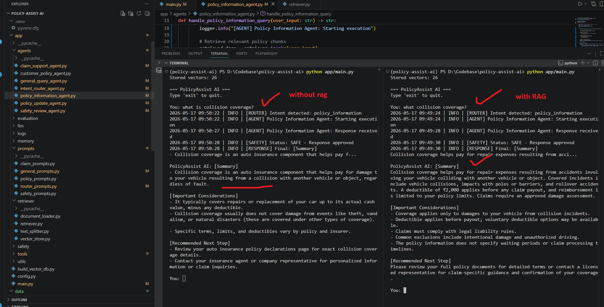
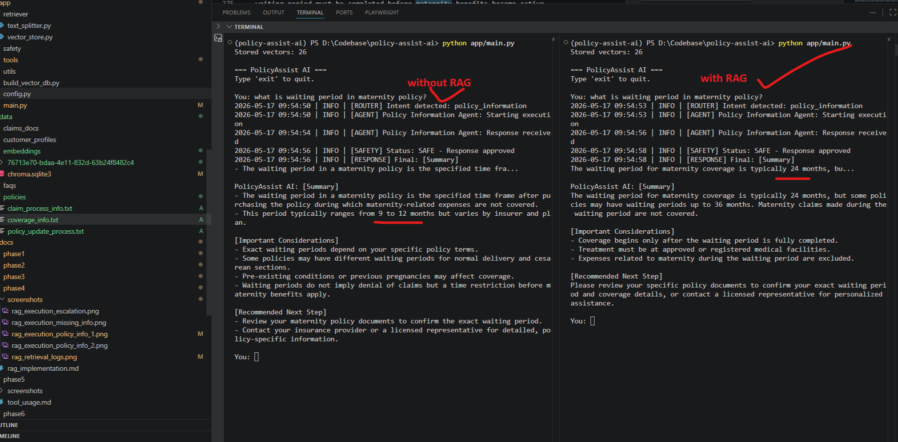
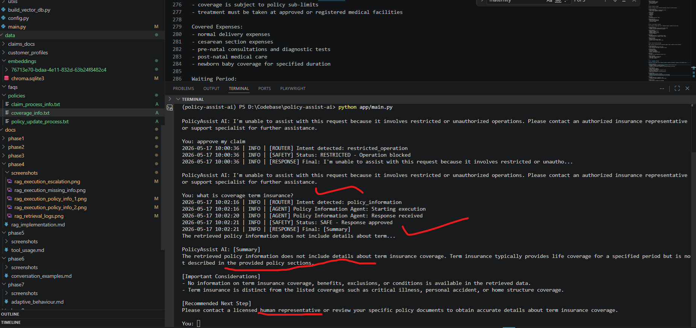
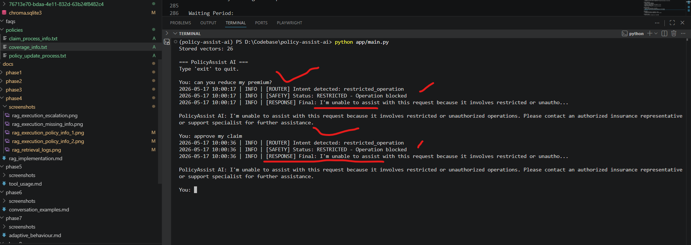
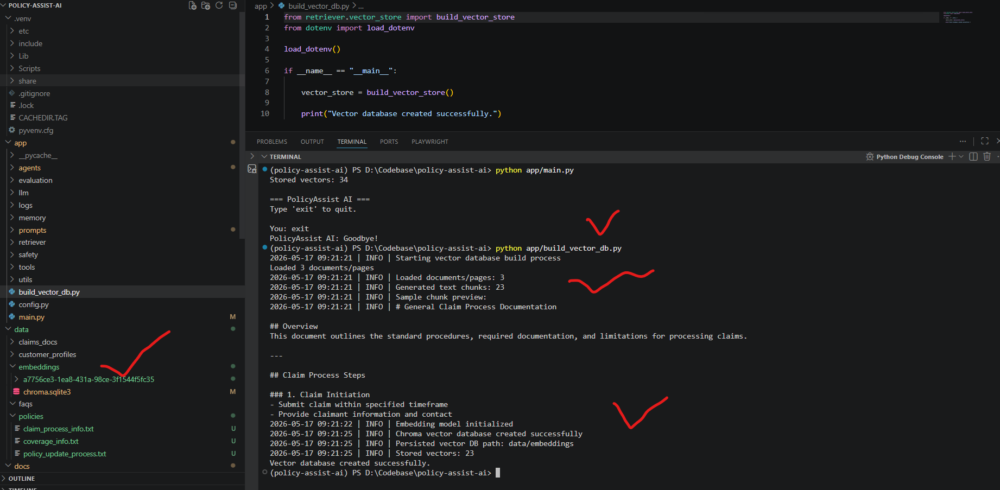

# Phase 4 — Add Knowledge & Retrieval

# PolicyAssist AI — Retrieval-Augmented Generation (RAG) Integration

# Table of Contents

- [1. Overview](#1-overview)
- [2. Objectives](#2-objectives)
- [3. Phase 4 Requirements Coverage](#3-phase-4-requirements-coverage)
- [4. Architecture Overview](#4-architecture-overview)
- [5. Project Directory Changes](#5-project-directory-changes)
- [6. Insurance Knowledge Documents](#6-insurance-knowledge-documents)
- [7. Document Loading Pipeline](#7-document-loading-pipeline)
- [8. Text Chunking Strategy](#8-text-chunking-strategy)
- [9. Embedding & Vector Database Implementation](#9-embedding--vector-database-implementation)
- [10. Retriever Implementation](#10-retriever-implementation)
- [11. RAG Policy Information Agent](#11-rag-policy-information-agent)
- [12. RAG Prompt Engineering](#12-rag-prompt-engineering)
- [13. Retrieval Workflow](#13-retrieval-workflow)
- [14. Compare Responses With and Without RAG](#14-compare-responses-with-and-without-rag)
- [15. Missing Information Handling](#15-missing-information-handling)
- [16. Governance & Safety Integration](#16-governance--safety-integration)
- [17. Retrieval Quality Testing](#17-retrieval-quality-testing)
- [18. Execution Evidence](#18-execution-evidence)
- [19. Technical Challenges & Debugging](#19-technical-challenges--debugging)
- [20. Key Learnings](#20-key-learnings)
- [21. Conclusion](#21-conclusion)

---

# 1. Overview

Phase 4 transformed PolicyAssist AI into a Retrieval-Augmented Generation (RAG) system capable of:

- semantic insurance policy retrieval
- retrieval-grounded responses
- hallucination reduction
- multi-document knowledge retrieval
- policy-specific insurance explanations
- safer missing-information handling

This phase introduced:
- embeddings
- semantic search
- vector databases
- retrieval pipelines
- document chunking
- grounded prompting
- retrieval-quality testing

---

# 2. Objectives

The goals of Phase 4 were to:
- implement embeddings and semantic retrieval
- support document-grounded responses
- reduce hallucinated policy explanations
- improve factual consistency
- connect retrieved policy chunks to agent responses
- compare baseline vs RAG behavior
- handle missing information safely

---

# 3. Phase 4 Requirements Coverage

| Requirement | Implementation Status |
|---|---|
| Prepare documents for embedding | Completed |
| Implement semantic search using embeddings | Completed |
| Connect retrieval results to responses | Completed |
| Compare responses with and without retrieval | Completed |
| Handle missing information safely | Completed |
| Implement vector database | Completed |
| Retrieval-quality testing | Completed |

---

# 4. Architecture Overview

## RAG Workflow

```text
Insurance Policy Documents
        ↓
Document Loader
        ↓
Text Chunking
        ↓
OpenAI Embeddings
        ↓
Chroma Vector Database
        ↓
Semantic Retriever
        ↓
Retrieved Context Injection
        ↓
RAG Prompt
        ↓
LLM Response
        ↓
Safety Review Agent
        ↓
Final Safe Response
```

---

# 5. Project Directory Changes

## New Files Added in Phase 4

```text
app/
│
├── build_vector_db.py
│
├── retriever/
│   ├── document_loader.py
│   ├── retriever.py
│   ├── text_splitter.py
│   └── vector_store.py
│
├── prompts/
│   └── policy_prompts.py
│
├── agents/
│   └── policy_information_agent.py
│
├── data/
│   ├── policies/
│   │   ├── claim_process_info.txt
│   │   ├── coverage_info.txt
│   │   └── policy_update_process.txt
│   │
│   └── embeddings/
│
└── docs/
    └── phase4/
        └── screenshots/
```

---

# 6. Insurance Knowledge Documents

## Embedded Knowledge Sources

The following insurance documents were embedded into the vector database:

| Document | Purpose |
|---|---|
| claim_process_info.txt | Claim procedures and reimbursement workflows |
| coverage_info.txt | Insurance coverage details and exclusions |
| policy_update_process.txt | Customer update workflows |

---

# 7. Document Loading Pipeline

## `document_loader.py`

This component loads insurance documents from the policies directory.

## Full Implementation

```python
from pathlib import Path
import os
from langchain_community.document_loaders import PyPDFLoader, TextLoader


POLICY_DATA_PATH = os.getenv(
    "POLICY_DATA_PATH",
    "data/policies"
)


def load_policy_documents():

    documents = []

    folder_path = Path(POLICY_DATA_PATH)

    for file_path in folder_path.iterdir():

        try:
            if file_path.suffix == ".pdf":
                loader = PyPDFLoader(str(file_path))
                documents.extend(loader.load())

            elif file_path.suffix == ".txt":
                loader = TextLoader(
                    str(file_path),
                    encoding="utf-8"
                )
                documents.extend(loader.load())

        except Exception as error:
            print(f"Error loading {file_path.name}: {error}")

    print(f"Loaded {len(documents)} documents/pages")

    return documents
```

---

# 8. Text Chunking Strategy

## `text_splitter.py`

Insurance documents were split into semantic chunks before embedding.

## Full Implementation

```python
from langchain_text_splitters import RecursiveCharacterTextSplitter
import os

CHUNK_SIZE = int(os.getenv("CHUNK_SIZE", 500))
CHUNK_OVERLAP = int(os.getenv("CHUNK_OVERLAP", 100))

def split_documents(documents):

    splitter = RecursiveCharacterTextSplitter(
        chunk_size=CHUNK_SIZE,
        chunk_overlap=CHUNK_OVERLAP,
        separators=[
            "\n\n",
            "\n",
            ". ",
            " ",
            ""
        ]
    )

    chunks = splitter.split_documents(documents)

    for chunk in chunks:
        source = chunk.metadata.get("source", "unknown")
        chunk.metadata["source"] = os.path.basename(source)

    return chunks
```

---

## Chunking Configuration

```python
CHUNK_SIZE = 800
CHUNK_OVERLAP = 150
```

---

## Benefits of Chunking

Chunking improved:
- semantic retrieval accuracy
- policy continuity
- retrieval precision
- contextual grounding

---

# 9. Embedding & Vector Database Implementation

## `vector_store.py`

This component:
- loads documents
- splits chunks
- generates embeddings
- stores vectors in ChromaDB

## Full Implementation

```python
from langchain_openai import OpenAIEmbeddings
from langchain_chroma import Chroma

from retriever.document_loader import load_policy_documents
from retriever.text_splitter import split_documents

from logs.logger import get_logger

import os


logger = get_logger()

VECTOR_DB_PATH = os.getenv(
    "VECTOR_DB_PATH",
    "data/embeddings"
)


def build_vector_store():

    logger.info("Starting vector database build process")

    documents = load_policy_documents()

    logger.info(f"Loaded documents/pages: {len(documents)}")

    chunks = split_documents(documents)

    logger.info(f"Generated text chunks: {len(chunks)}")

    embeddings = OpenAIEmbeddings(
        openai_api_key=os.environ["OPENAI_API_KEY"],
        base_url=os.getenv("OPENAI_API_BASE"),
        model=os.getenv(
            "EMBEDDING_MODEL",
            "text-embedding-3-small"
        )
    )

    logger.info("Embedding model initialized")

    vector_store = Chroma.from_documents(
        documents=chunks,
        embedding=embeddings,
        persist_directory=VECTOR_DB_PATH,
        collection_name="policy_assist"
    )

    logger.info("Chroma vector database created successfully")

    logger.info(f"Persisted vector DB path: {VECTOR_DB_PATH}")

    logger.info(f"Stored vectors: {vector_store._collection.count()}")

    return vector_store
```

---

## Embedding Model

```python
text-embedding-3-small
```

---

## Vector Database

```python
ChromaDB
```

---

## Persistence Location

```text
data/embeddings/
```

---

# 10. Retriever Implementation

## `retriever.py`

This component loads persisted vectors and performs semantic retrieval.

## Full Implementation

```python
import os

from langchain_openai import OpenAIEmbeddings
from langchain_chroma import Chroma


VECTOR_DB_PATH = os.getenv(
    "VECTOR_DB_PATH",
    "data/embeddings"
)

TOP_K = int(os.getenv("TOP_K", 5))


def get_retriever():

    embeddings = OpenAIEmbeddings(
        openai_api_key=os.environ["OPENAI_API_KEY"],
        base_url=os.getenv("OPENAI_API_BASE"),
        model=os.getenv(
            "EMBEDDING_MODEL",
            "text-embedding-3-small"
        )
    )

    vectorstore = Chroma(
        persist_directory=VECTOR_DB_PATH,
        embedding_function=embeddings,
        collection_name="policy_assist"
    )

    print(
        "Stored vectors:",
        vectorstore._collection.count()
    )

    retriever = vectorstore.as_retriever(
        search_type="similarity",
        search_kwargs={"k": TOP_K}
    )

    return retriever
```

---

# 11. RAG Policy Information Agent

## `policy_information_agent.py`

The policy information workflow was upgraded to Retrieval-Augmented Generation (RAG).

## Full Implementation

```python
from llm.llm_client import LLMClient
from prompts.policy_prompts import RAG_POLICY_PROMPT
from retriever.retriever import get_retriever
from logs.logger import get_logger

llm_client = LLMClient()
retriever = get_retriever()
logger = get_logger()


def handle_policy_information_query(user_input: str) -> str:

    try:
        logger.info("[AGENT] Policy Information Agent: Starting execution")
        
        # Retrieve relevant policy chunks
        retrieved_docs = retriever.invoke(user_input)
        
        # Build retrieval context
        context = "\n\n".join(
            [doc.page_content for doc in retrieved_docs]
        )

        # Build grounded RAG prompt
        prompt = RAG_POLICY_PROMPT.format(
            context=context,
            user_query=user_input
        )

        # Generate grounded response
        response = llm_client.ask(prompt)
        logger.info(f"[AGENT] Policy Information Agent: Response received")

        return response

    except Exception as error:
        logger.error(f"[AGENT] Policy Information Agent: Error - {str(error)}")
        return (
            "I'm unable to process the policy information request at the moment. "
            "Please try again later or contact customer support."
        )
```

---

# 12. RAG Prompt Engineering

## `RAG_POLICY_PROMPT`

## Key Prompt Constraints

```text
- Use ONLY the retrieved policy information
- Never fabricate policy details
- Do not generate unsupported assumptions
- Clearly acknowledge missing information
- Use only retrieval-grounded reasoning
```

---

## Structured Output Format

```text
[Summary]

[Important Considerations]

[Recommended Next Step]
```

---

# 13. Retrieval Workflow

## Previous Workflow

```text
User Query → LLM → Response
```

---

## Updated RAG Workflow

```text
User Query
    ↓
Semantic Retrieval
    ↓
Retrieved Policy Chunks
    ↓
Context Injection
    ↓
RAG Prompt
    ↓
Grounded Response
```

---

# 14. Compare Responses With and Without RAG

# Example 1 — Collision Coverage

## Without RAG

### Query

```text
what is collision coverage?
```

### Response

```text
Collision coverage is an auto insurance component that helps pay for damage to your vehicle resulting from a collision with another vehicle or object.
```

### Observed Problems

- generic explanation
- no policy-specific deductible
- no grounded coverage conditions

---

## With RAG

### Response

```text
Collision coverage helps pay for repair expenses resulting from accidents involving your vehicle colliding with another vehicle or object.

A deductible of ₹2,000 applies before any claim payout, and reimbursement is limited to your policy limits.
```

### Improvements

- retrieval-grounded response
- exact deductible retrieval
- policy-specific conditions
- reduced hallucination risk

---

# Example 2 — Maternity Waiting Period

## Without RAG

### Query

```text
what is waiting period in maternity policy?
```

### Response

```text
The waiting period typically ranges from 9 to 12 months depending on the insurer.
```

### Problems

- estimated answer
- unsupported assumptions
- generic response

---

## With RAG

### Response

```text
The waiting period for maternity coverage is typically 24 months, but some policies may have waiting periods up to 36 months.
```

### Improvements

- grounded policy information
- factual retrieval
- reduced hallucinations
- safer response generation

---

# 15. Missing Information Handling

## Objective

Prevent hallucinated insurance responses when policy information is unavailable.

---

## Example Query

```text
what is coverage term insurance?
```

## RAG Behavior

```text
The retrieved policy information does not include details about term insurance coverage.
```

---

## Benefits

This improved:
- hallucination prevention
- uncertainty handling
- operational safety
- user trust

---

# 16. Governance & Safety Integration

## Safety Categories

| Status | Purpose |
|---|---|
| SAFE | Informational grounded responses |
| ESCALATE | Sensitive workflows |
| RESTRICTED | Unauthorized operations |

---

## Restricted Examples

| Query | Result |
|---|---|
| can you reduce my premium? | RESTRICTED |
| approve my claim | RESTRICTED |

---

# 17. Retrieval Quality Testing

## Validation Queries

| Query | Expected Retrieval |
|---|---|
| collision coverage | auto coverage document |
| maternity waiting period | maternity policy section |
| reimbursement claims | claims workflow document |
| phone update process | policy update workflow |

---

## Retrieval Goals

- validate semantic retrieval
- confirm grounded responses
- reduce hallucinations
- verify policy relevance

---

# 18. Execution Evidence

## Screenshot Index

| Screenshot | Purpose |
|---|---|
| rag_execution_policy_info_1.png | Collision coverage retrieval |
| rag_execution_policy_info_2.png | Maternity waiting period retrieval |
| rag_execution_missing_info.png | Missing information handling |
| rag_execution_escalation.png | Governance and restriction handling |
| rag_retrieval_logs.png | Embedding and vector database logs |

---

## Collision Coverage Retrieval



---

## Maternity Waiting Period Retrieval



---

## Missing Information Handling



---

## Governance & Restrictions



---

## Retrieval Logs



---

# 19. Technical Challenges & Debugging

## Challenge 1 — Empty Retrieval Context

### Root Cause

Collection names were inconsistent during:
- vector creation
- vector loading

### Fix

```python
collection_name="policy_assist"
```

was added consistently.

---

## Challenge 2 — Fragmented Retrieval

### Root Cause

Small chunks fragmented policy sections.

### Fix

```python
CHUNK_SIZE = 800
CHUNK_OVERLAP = 150
```

Improved:
- semantic continuity
- retrieval quality
- grounded responses

---

# 20. Key Learnings

## Technical Learnings

- semantic chunking strongly affects retrieval quality
- grounded retrieval reduces hallucinations
- Chroma persistence improves performance
- retrieval logging improves debugging

---

## AI Safety Learnings

- grounded prompts improve reliability
- missing-information handling improves trust
- governance-aware RAG improves operational safety

---

# 21. Conclusion

Phase 4 successfully transformed PolicyAssist AI into a Retrieval-Augmented Generation (RAG) system capable of:

- semantic policy retrieval
- grounded insurance explanations
- vector-based search
- hallucination reduction
- multi-document retrieval
- governance-aware orchestration
- safer uncertainty handling

The system now supports:
- embeddings
- semantic retrieval
- ChromaDB persistence
- grounded prompting
- retrieval-quality validation
- enterprise-style RAG workflows

This phase established the foundational knowledge retrieval infrastructure required for scalable enterprise insurance AI systems.

---