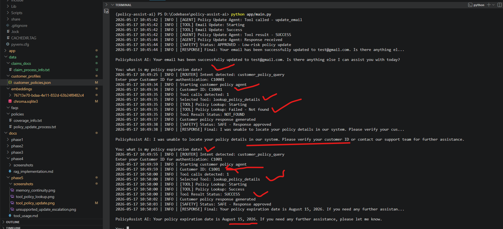
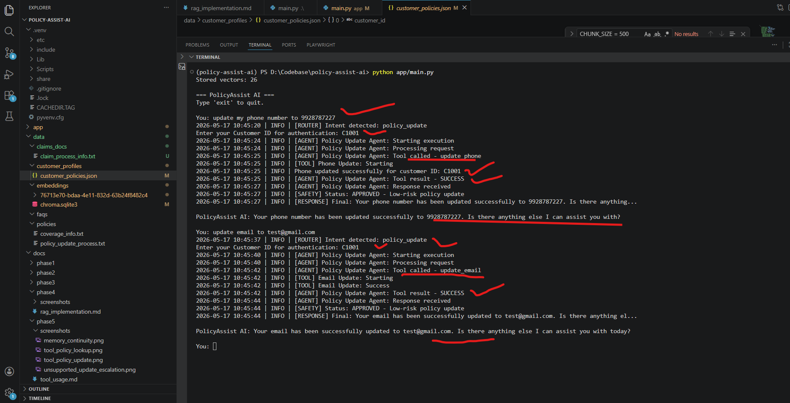
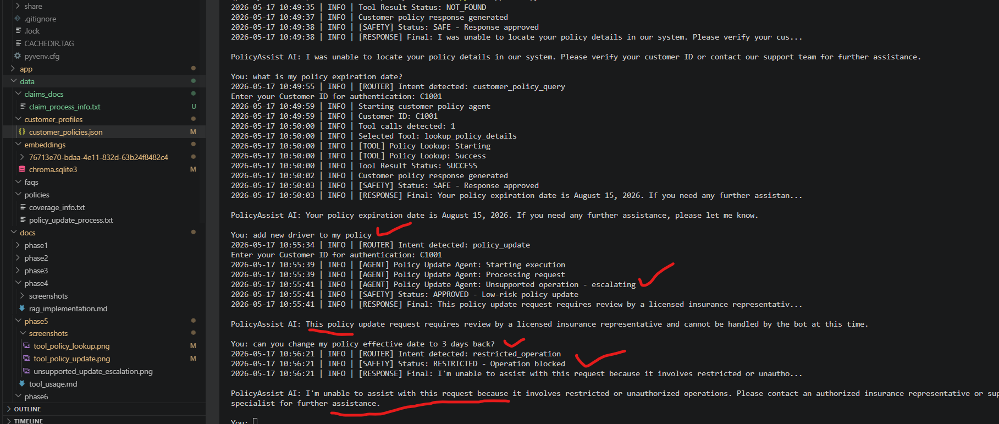
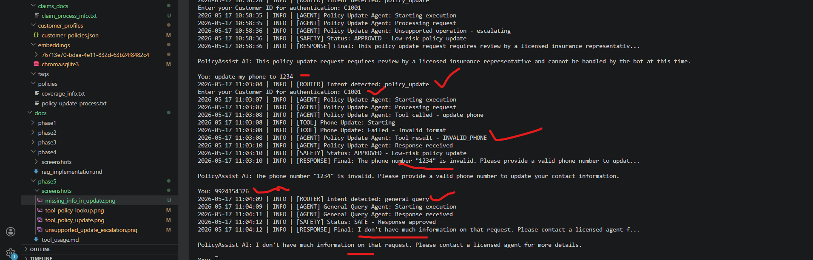
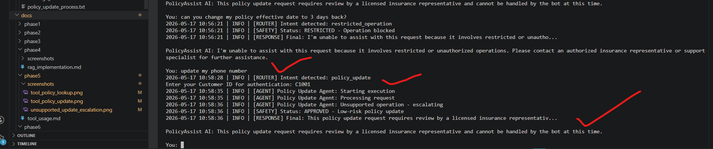

# Phase 5 — Tool Usage & Operational Workflows

## Table of Contents

1. [Introduction](#1-introduction)
2. [Phase 5 Requirements Coverage](#2-phase-5-requirements-coverage)
3. [Project Structure Changes](#3-project-structure-changes)
4. [Architecture Overview](#4-architecture-overview)
5. [Implemented Tools](#5-implemented-tools)
6. [Tool Calling Workflow](#6-tool-calling-workflow)
7. [Tool Binding & Session-Oriented Execution](#7-tool-binding--session-oriented-execution)
8. [Customer Policy Retrieval Workflow](#8-customer-policy-retrieval-workflow)
9. [Policy Update Workflow](#9-policy-update-workflow)
10. [Unsupported Operations & Escalation](#10-unsupported-operations--escalation)
11. [Failed / Incorrect Tool Usage](#11-failed--incorrect-tool-usage)
12. [Memory & Context Limitations](#12-memory--context-limitations)
13. [Safeguards & Loop Prevention](#13-safeguards--loop-prevention)
14. [Key Improvements Over Earlier Phases](#14-key-improvements-over-earlier-phases)
15. [Technical Challenges & Failure Analysis](#15-technical-challenges--failure-analysis)
16. [Execution Evidence](#16-execution-evidence)
17. [Phase Summary](#17-phase-summary)

---

# 1. Introduction

Phase 5 introduced controlled tool usage into PolicyAssist AI to support customer-specific operational workflows using enterprise-style orchestration and governance controls.

The system was enhanced with:

- tool/function calling
- operational workflows
- customer-specific retrieval
- controlled update execution
- validation safeguards
- escalation handling
- deterministic orchestration
- operational logging

Unlike autonomous agent architectures, this implementation intentionally uses:

- explicit orchestration
- approved tool exposure
- controlled execution boundaries
- deterministic workflow routing

to improve:

- explainability
- governance
- debugging reliability
- operational safety

---

# 2. Phase 5 Requirements Coverage

## Official Phase 5 Requirements

| Requirement | Status |
|---|---|
| Define at least two tools | Completed |
| Implement tool calling logic | Completed |
| Demonstrate correct tool selection | Completed |
| Show failed or incorrect tool usage | Completed |
| Add safeguards against misuse or loops | Completed |

---

# 3. Project Structure Changes

## New Tool Layer

```text
app/tools/
│
├── policy_lookup_tool.py
├── update_email_tool.py
├── update_phone_tool.py
└── utils.py
```

---

## Updated Agents

```text
app/agents/
│
├── customer_policy_agent.py
└── policy_update_agent.py
```

---

# 4. Architecture Overview

## Phase 5 Operational Architecture

```text
Customer Query
        ↓
Intent Router Agent
        ↓
──────────────────────────────────────
│                 │
↓                 ↓
Customer           Policy
Policy Agent       Update Agent
│                 │
│                 ├── update_email_tool
│                 └── update_phone_tool
│
└── lookup_policy_details
        ↓
Tool Result
        ↓
Grounded Response
        ↓
Safety Review Agent
        ↓
Final Response
```

---

## Workflow Characteristics

The architecture uses:

- deterministic orchestration
- explicit tool exposure
- controlled operational execution
- centralized safety review
- governance-first workflows

The system intentionally avoids:

- autonomous recursive agents
- uncontrolled ReAct loops
- unrestricted tool access
- self-generated execution chains

---

# 5. Implemented Tools

## Implemented Operational Tools

| Tool / Utility | Purpose |
|---|---|
| `lookup_policy_details` | Retrieves customer-specific policy information |
| `update_email` | Updates customer email address |
| `update_phone` | Updates customer phone number |
| `utils.py` | Shared customer policy retrieval and persistence layer |

---

## Tool — Policy Lookup

### File

```text
app/tools/policy_lookup_tool.py
```

### Full Code

```python
from langchain_core.tools import tool
from tools.utils import get_customer_policy
from logs.logger import get_logger

logger = get_logger()

@tool
def lookup_policy_details(
    customer_id: str
) -> dict:

    logger.info("[TOOL] Policy Lookup: Starting")

    policy = get_customer_policy(customer_id)

    if not policy:
        logger.info("[TOOL] Policy Lookup: Failed - Not found")

        return {
            "status": "NOT_FOUND",
            "message": "Customer policy record not found."
        }

    logger.info("[TOOL] Policy Lookup: Success")

    return {
        "status": "SUCCESS",
        "policy_details": policy
    }
```

---

## Tool — Email Update

### File

```text
app/tools/update_email_tool.py
```

### Full Code

```python
import re

from langchain_core.tools import tool

from tools.utils import (
    get_customer_policy,
    save_customer_policy
)

def is_valid_email(email: str) -> bool:

    email_pattern = r"^[^@]+@[^@]+\.[^@]+$"

    return bool(re.match(email_pattern, email))


@tool
def update_email(
    customer_id: str,
    new_email: str
) -> dict:

    if not is_valid_email(new_email):

        return {
            "status": "INVALID_EMAIL",
            "message": "Provided email address is invalid."
        }

    policy = get_customer_policy(customer_id)

    if not policy:

        return {
            "status": "NOT_FOUND",
            "message": "Customer policy record not found."
        }

    old_email = policy.get("email")

    policy["email"] = new_email

    save_customer_policy(policy)

    return {
        "status": "SUCCESS",
        "message": "Customer email updated successfully.",
        "old_email": old_email,
        "new_email": new_email
    }
```

---

## Tool — Phone Update

### File

```text
app/tools/update_phone_tool.py
```

### Full Code

```python
import re

from langchain_core.tools import tool

from tools.utils import (
    get_customer_policy,
    save_customer_policy
)

def is_valid_phone(phone: str) -> bool:

    phone_pattern = r"^[0-9]{10}$"

    return bool(re.match(phone_pattern, phone))


@tool
def update_phone(
    customer_id: str,
    new_phone: str
) -> dict:

    if not is_valid_phone(new_phone):

        return {
            "status": "INVALID_PHONE",
            "message": (
                "Provided phone number is invalid."
            )
        }

    policy = get_customer_policy(customer_id)

    if not policy:

        return {
            "status": "NOT_FOUND",
            "message": (
                "Customer policy record not found."
            )
        }

    old_phone = policy.get("phone")

    policy["phone"] = new_phone

    save_customer_policy(policy)

    return {
        "status": "SUCCESS",
        "message": (
            "Customer phone number updated successfully."
        ),
        "old_phone": old_phone,
        "new_phone": new_phone
    }
```

---

## Tool Utilities

### File

```text
app/tools/utils.py
```

### Purpose

The utility layer centralizes:

- customer policy loading
- customer policy retrieval
- policy persistence
- JSON storage operations

This utility layer is shared across:
- policy lookup tools
- email update tools
- phone update tools

to avoid duplicated operational logic.

---

### Full Code

```python
import os
import json

DATA_PATH = os.getenv("CUSTOMER_POLICY_DATA_PATH")


def load_customer_policies():

    if not DATA_PATH:

        raise ValueError(
            "CUSTOMER_POLICY_DATA_PATH not set"
        )

    with open(DATA_PATH, "r") as file:
        return json.load(file)


def get_customer_policy(customer_id: str):

    policies = load_customer_policies()

    for policy in policies:

        if (
            policy["customer_id"]
            == customer_id
        ):

            return policy

    return None


def save_customer_policy(updated_policy):

    if (
        "policy_number"
        not in updated_policy
    ):

        raise ValueError(
            "Updated policy missing policy_number."
        )

    policies = load_customer_policies()

    updated = False

    for index, policy in enumerate(policies):

        if (
            policy["policy_number"]
            == updated_policy["policy_number"]
        ):

            policies[index] = updated_policy
            updated = True
            break

    if not updated:

        raise ValueError(
            "Policy number not found."
        )

    with open(DATA_PATH, "w") as file:

        json.dump(
            policies,
            file,
            indent=2
        )

    return True
```

---

# 6. Tool Calling Workflow

## Customer Policy Agent

### File

```text
app/agents/customer_policy_agent.py
```

### Full Code

```python
from langchain_core.messages import (
    HumanMessage,
    ToolMessage
)

from llm.llm_client import LLMClient

from tools.policy_lookup_tool import (
    lookup_policy_details
)

llm_client = LLMClient()

llm = llm_client.llm

tools = [lookup_policy_details]

tool_enabled_llm = llm.bind_tools(tools)


def handle_customer_policy_query(
    user_query: str,
    customer_id: str
) -> str:

    messages = [
        HumanMessage(
            content=f"""
Authenticated Customer ID: {customer_id}

Available Tool:
- lookup_policy_details

Customer Query:
{user_query}
"""
        )
    ]

    response = tool_enabled_llm.invoke(messages)

    if response.tool_calls:

        for tool_call in response.tool_calls:

            tool_args = tool_call["args"]

            if "customer_id" not in tool_args:
                tool_args["customer_id"] = customer_id

            tool_result = lookup_policy_details.invoke(
                tool_args
            )

            messages.append(response)

            messages.append(
                ToolMessage(
                    tool_call_id=tool_call["id"],
                    content=str(tool_result)
                )
            )

        final_response = llm.invoke(messages)

        return final_response.content

    return response.content
```

---

## Policy Update Agent

### File

```text
app/agents/policy_update_agent.py
```

### Full Code

```python
from langchain_core.messages import (
    HumanMessage,
    ToolMessage
)

from llm.llm_client import LLMClient

from tools.update_email_tool import update_email
from tools.update_phone_tool import update_phone

llm_client = LLMClient()

llm = llm_client.llm

tools = [
    update_email,
    update_phone
]

tool_enabled_llm = llm.bind_tools(tools)


def handle_policy_update_request(
    user_query: str,
    customer_id: str
) -> str:

    messages = [
        HumanMessage(
            content=f"""
Authenticated Customer ID:
{customer_id}

Available Tools:
- update_email
- update_phone

Customer Query:
{user_query}
"""
        )
    ]

    response = tool_enabled_llm.invoke(messages)

    if response.tool_calls:

        for tool_call in response.tool_calls:

            tool_name = tool_call["name"]

            tool_args = tool_call["args"]

            if "customer_id" not in tool_args:
                tool_args["customer_id"] = customer_id

            selected_tool = next(
                (
                    tool
                    for tool in tools
                    if tool.name == tool_name
                ),
                None
            )

            if not selected_tool:
                continue

            tool_result = selected_tool.invoke(
                tool_args
            )

            messages.append(response)

            messages.append(
                ToolMessage(
                    tool_call_id=tool_call["id"],
                    content=str(tool_result)
                )
            )

        final_response = llm.invoke(messages)

        return final_response.content

    return (
        "This policy update request requires review "
        "by a licensed insurance representative."
    )
```

---

# 7. Tool Binding & Session-Oriented Execution

Phase 5 introduced dynamic tool-aware LLM execution using LangChain tool binding.

The agents now support:

- tool-aware LLM execution
- dynamic tool selection
- authenticated customer sessions
- controlled operational workflows
- grounded tool result injection

---

## Tool Binding Architecture

The system binds approved tools directly to the LLM.

### Example

```python
tools = [
    update_email,
    update_phone
]

tool_enabled_llm = llm.bind_tools(tools)
```

This allows the LLM to:

- decide when tools are needed
- generate structured tool calls
- pass arguments dynamically
- avoid unsupported operations

while still operating within controlled boundaries.

---

## Customer Session Injection

Authenticated customer identity is explicitly injected into workflows.

### Example

```python
messages = [
    HumanMessage(
        content=f"""
Authenticated Customer ID:
{customer_id}

Available Tools:
- update_email
- update_phone

Customer Query:
{user_query}
"""
    )
]
```

This ensures:

- customer-specific grounding
- controlled access
- operational traceability
- authenticated tool execution

---

## Dynamic Tool Selection

The LLM dynamically selects tools based on user requests.

### Example Logic

```python
if response.tool_calls:

    for tool_call in response.tool_calls:

        tool_name = tool_call["name"]

        tool_args = tool_call["args"]
```

This enables:

- flexible operational workflows
- controlled automation
- dynamic execution paths

without exposing unrestricted autonomy.

---

## Tool Result Injection

Tool responses are injected back into the LLM conversation.

### Example

```python
messages.append(
    ToolMessage(
        tool_call_id=tool_call["id"],
        content=str(tool_result)
    )
)
```

This allows the final response to remain:

- grounded
- operationally accurate
- tool-verified
- customer-specific

---

## Final Response Generation

After tool execution, the grounded response is generated.

### Example

```python
final_response = llm.invoke(messages)

return final_response.content
```

---

## Controlled Tool Exposure

Each agent receives access only to explicitly approved tools.

| Agent | Allowed Tools |
|---|---|
| Customer Policy Agent | `lookup_policy_details` |
| Policy Update Agent | `update_email`, `update_phone` |

---

# 8. Customer Policy Retrieval Workflow

## Example Query

```text
What is my policy expiration date?
```

## Workflow Behaviour

The system:

- detected customer policy intent
- requested customer authentication
- selected `lookup_policy_details`
- retrieved grounded customer data
- generated policy-grounded response

## Execution Evidence



---

# 9. Policy Update Workflow

## Example Queries

```text
Update my phone number to 9928787227
```

```text
Update my email to test@gmail.com
```

## Workflow Behaviour

The system:

- routed request to Policy Update Agent
- selected correct operational tool
- validated input data
- updated customer record
- persisted updated information
- generated operational confirmation response

## Execution Evidence



---

# 10. Unsupported Operations & Escalation

## Example Queries

```text
Add new driver to my policy
```

```text
Can you change my policy effective date to 3 days back?
```

## Workflow Behaviour

The system:

- detected unsupported operations
- avoided unauthorized execution
- escalated unsupported workflows
- blocked restricted requests

## Execution Evidence



---

# 11. Failed / Incorrect Tool Usage

## Scenario 1 — Invalid Tool Input

### Example Query

```text
Update my phone to 1234
```

## Observed Behaviour

The system:

- correctly selected `update_phone`
- executed tool validation
- detected invalid phone format
- safely blocked update execution
- generated validation response

## Execution Evidence



---

## Scenario 2 — Unsupported Tool Request

### Example Query

```text
Add new driver to my policy
```

## Observed Behaviour

The system:

- evaluated available tools
- determined no approved tool existed
- avoided unsafe execution
- escalated request safely

## Execution Evidence


---

# 12. Memory & Context Limitations

## Observed Limitation

Phase 5 still lacks:

- conversational memory
- workflow continuation
- slot filling
- multi-turn context retention

---

## Example Failure

### User Interaction

```text
User:
Update my phone to 1234
```

Tool validation failed because the phone number was invalid.

The user then replied:

```text
9924154326
```

## Failure Behaviour

Instead of continuing the update workflow:

- the system lost operational context
- intent routing restarted
- the new number was treated as a standalone query
- the update workflow failed to resume

## Execution Evidence


---

## Additional Missing Information Failure

### Example Query

```text
Update my phone number
```

The user did not provide a new phone number.

The system:

- could not infer missing information
- lacked clarification capability
- escalated request instead of continuing interaction

## Execution Evidence



---

# 13. Safeguards & Loop Prevention

## Implemented Safeguards

| Safeguard | Purpose |
|---|---|
| Email validation | Prevent invalid email persistence |
| Phone validation | Prevent invalid phone persistence |
| Customer existence validation | Prevent invalid policy access |
| Restricted operation blocking | Prevent unsafe policy modifications |
| Explicit tool exposure | Prevent unauthorized tool execution |
| Human escalation | Handle unsupported workflows safely |

---

## Loop Prevention

The architecture intentionally avoids:

- autonomous recursive loops
- uncontrolled ReAct workflows
- self-generated execution chains
- repeated autonomous retries

Each workflow uses:

- deterministic orchestration
- single-step tool execution
- explicit workflow termination

---

# 14. Key Improvements Over Earlier Phases

| Capability | Earlier Phases | Phase 5 |
|---|---|---|
| Tool usage | Not available | Implemented |
| Customer retrieval | Not supported | Supported |
| Dynamic operations | Not supported | Supported |
| Validation safeguards | Limited | Improved |
| Operational persistence | Not available | Added |
| Escalation handling | Basic | Structured |
| Tool orchestration | Not available | Implemented |
| Governance controls | Partial | Improved |

---

# 15. Technical Challenges & Failure Analysis

## Challenge 1 — Invalid Operational Inputs

### Example

```text
Update my phone to 1234
```

### Fix

Validation safeguards were added:

```python
phone_pattern = r"^[0-9]{10}$"
```

---

## Challenge 2 — Unsupported Operations

### Example

```text
Add new driver
```

### Fix

The Policy Update Agent now:

- exposes only approved tools
- escalates unsupported requests
- blocks unauthorized modifications

---

## Challenge 3 — No Workflow Continuity

### Root Cause

No conversational memory or workflow state persistence exists yet.

### Impact

- repeated authentication prompts
- broken update flows
- no slot filling
- no continuation reasoning

### Planned Improvement

Phase 6 introduces:

- conversational memory
- session persistence
- multi-turn workflow handling
- clarification workflows

---

# 16. Execution Evidence


| Screenshot | Purpose |
|---|---|
| [tool_policy_lookup.png](screenshots/tool_policy_lookup.png) | Demonstrates customer-specific policy retrieval using the `lookup_policy_details` tool with both successful and failed customer lookup scenarios. |
| [tool_policy_update.png](screenshots/tool_policy_update.png) | Demonstrates successful operational tool execution for updating customer phone number and email address using controlled tool calling workflows. |
| [unsupported_update_escalation.png](screenshots/unsupported_update_escalation.png) | Demonstrates escalation handling for unsupported policy modification requests and restricted operation blocking for unauthorized changes. |
| [invalid_phone.png](screenshots/invalid_phone.png) | Demonstrates invalid tool input validation where incorrect phone number format is safely rejected before update execution. Also highlights missing conversational memory after validation failure. |
| [missing_info_in_update.png](screenshots/missing_info_in_update.png) | Demonstrates missing information handling limitation where the system cannot continue update workflows without complete required input data. |

---

# 17. Phase Summary

Phase 5 successfully transformed PolicyAssist AI from a retrieval-oriented assistant into a controlled workflow-oriented operational AI system.

The implementation introduced:

- LangChain tool calling
- customer-specific retrieval
- operational update workflows
- validation safeguards
- escalation handling
- deterministic orchestration
- governance-aware execution

The system now supports:

- grounded policy lookup
- controlled operational updates
- explicit tool execution
- validation-first workflows
- operational persistence
- safe failure handling

while still exposing important limitations related to:

- memory
- context continuity
- multi-turn reasoning
- clarification workflows

These limitations directly motivate the improvements introduced in Phase 6.