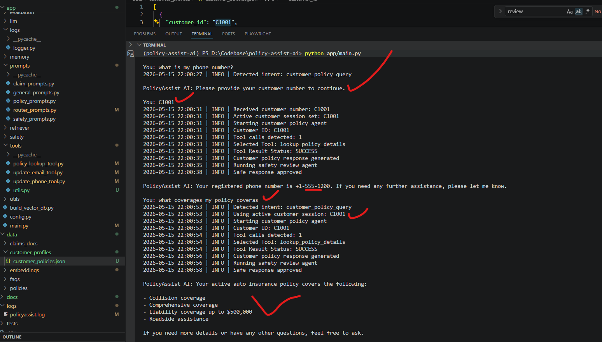

# Phase 5 — Tool Usage & Operational Workflows

## Index

1. [Introduction](#1-introduction)  
2. [Phase 5 Objectives](#2-phase-5-objectives)  
3. [Implemented Tools](#3-implemented-tools)  
4. [Tool Calling Architecture](#4-tool-calling-architecture)  
5. [Customer Policy Retrieval Workflow](#5-customer-policy-retrieval-workflow)  
6. [Policy Update Workflow](#6-policy-update-workflow)  
7. [Unsupported Update Escalation](#7-unsupported-update-escalation)  
8. [Failed / Incorrect Tool Usage](#8-failed--incorrect-tool-usage)  
9. [Memory Continuity](#9-memory-continuity)  
10. [Safeguards & Loop Prevention](#10-safeguards--loop-prevention)  
11. [Improvements Over Earlier Phases](#11-improvements-over-earlier-phases)  
12. [Outcome Summary](#12-outcome-summary)

---

# 1. Introduction

Phase 5 introduced controlled tool usage into PolicyAssist AI to support customer-specific operational workflows in a safer and more enterprise-oriented manner.

The system was enhanced with:
- tool/function calling
- customer-specific operational workflows
- controlled update operations
- tool routing logic
- validation safeguards
- memory continuity
- escalation handling

Unlike autonomous agent architectures, this implementation uses deterministic orchestration and controlled tool exposure to improve reliability, explainability, and operational safety.

---

# 2. Phase 5 Objectives

The following Phase 5 requirements were implemented:

| Requirement | Status |
|---|---|
| Define at least two tools | Completed |
| Implement tool calling logic | Completed |
| Demonstrate correct tool selection | Completed |
| Show failed or incorrect tool usage | Completed |
| Add safeguards against misuse or loops | Completed |

---

# 3. Implemented Tools

The following operational tools were implemented.

| Tool | Purpose |
|---|---|
| `policy_lookup_tool.py` | Retrieves customer-specific policy information |
| `update_email_tool.py` | Updates customer email address |
| `update_phone_tool.py` | Updates customer phone number |

---

# 4. Tool Calling Architecture

PolicyAssist AI uses controlled LLM tool calling with explicit orchestration.

## Workflow

1. Intent Router classifies customer intent
2. Appropriate agent is selected
3. Agent invokes approved tools
4. Tool results are returned to the LLM
5. Final response passes through Safety Review Agent

## Architecture Flow

```text
Customer Query
    ↓
Intent Router
    ↓
Agent Selection
    ↓
Tool Calling
    ↓
Tool Result
    ↓
Grounded Response
    ↓
Safety Review
```

This architecture avoids uncontrolled autonomous behaviour while still enabling dynamic operational workflows.

---

# 5. Customer Policy Retrieval Workflow

## Scenario

Customer requests customer-specific policy information.

### Example Query

```text
What is my policy expiration date?
```

## Workflow Behaviour

The system:
- detects a customer-specific policy request
- requests customer identification
- activates customer session memory
- invokes `policy_lookup_tool`
- retrieves grounded policy information
- generates final grounded response

## Observed Behaviour

- Tool selection was successful
- Customer-specific policy retrieval completed
- Final response remained grounded in retrieved data

## Evidence


---

# 6. Policy Update Workflow

## Scenario

Customer requests contact information updates.

### Example Queries

```text
Update my email to john.updated@email.com
```

```text
Update my phone number to 9876543210
```

## Workflow Behaviour

The system:
- routes request to Policy Update Agent
- selects correct operational tool
- validates provided information
- updates customer policy record
- persists changes to storage
- generates operational confirmation response

## Implemented Tool Logic

### Email Updates
Handled by:
```text
update_email_tool.py
```

### Phone Updates
Handled by:
```text
update_phone_tool.py
```

## Evidence


---

# 7. Unsupported Update Escalation

## Scenario

Customer attempts unsupported policy modifications.

### Example Queries

```text
Update my policy expiration date
```

```text
Add new driver to my policy
```

## Workflow Behaviour

The system:
- identifies unsupported operational requests
- avoids unauthorized policy modifications
- escalates request to licensed insurance representatives
- prevents unsafe operational execution

## Safety Behaviour

No unauthorized updates are executed.

The assistant safely informs the customer that:
- human review is required
- operation cannot be handled automatically

## Evidence


---

# 8. Failed / Incorrect Tool Usage

## Scenario

Customer requested an unsupported policy update operation.

### Example Query

```text
Add new driver to my policy
```

## Behaviour

The Policy Update Agent evaluated available tools and determined:
- no approved tool existed for the request
- the operation required human review

Instead of:
- fabricating capabilities
- executing unsafe updates
- attempting unsupported tool calls

the system safely escalated the request.

## Importance

This demonstrates:
- controlled tool selection
- operational boundary enforcement
- safe handling of unsupported workflows

## Evidence


---

# 9. Memory Continuity

## Scenario

Customer continues asking policy-related questions after identification.

### Example Conversation

```text
What is my phone number?
```

followed by:

```text
What coverages does my policy include?
```

## Workflow Behaviour

The system:
- retained active customer session
- avoided repeated customer identification prompts
- reused active customer context
- maintained conversational continuity

## Implemented Memory Logic

The application maintains:
- active customer session ID
- temporary conversation state
- pending workflow state

## Evidence



---

# 10. Safeguards & Loop Prevention

PolicyAssist AI includes multiple operational safeguards to reduce unsafe behaviour and uncontrolled execution.

---

## Restricted Operation Blocking

Requests involving:
- policy date changes
- unauthorized modifications
- unsupported operational actions

are blocked or escalated.

---

## Controlled Tool Exposure

Agents only receive access to explicitly approved tools.

### Customer Policy Agent
Allowed Tool:
- `policy_lookup_tool.py`

### Policy Update Agent
Allowed Tools:
- `update_email_tool.py`
- `update_phone_tool.py`

---

## Validation Before Updates

Operational tools validate:
- email format
- phone number format
- customer existence

before persisting changes.

---

## Human Escalation

Unsupported update requests automatically escalate to licensed insurance representatives.

---

## Loop Prevention

The system intentionally avoids:
- autonomous recursive agents
- uncontrolled multi-step execution
- ReAct reasoning loops

Each workflow uses:
- deterministic orchestration
- single-step tool execution
- explicit workflow termination

This improves:
- explainability
- governance
- debugging reliability
- operational safety

---

# 11. Improvements Over Earlier Phases

| Capability | Earlier Phases | Phase 5 |
|---|---|---|
| Customer-specific retrieval | Not supported | Supported |
| Operational updates | Not supported | Supported |
| Tool orchestration | Not available | Implemented |
| Session continuity | Limited | Improved |
| Update validation | Not available | Implemented |
| Human escalation | Basic | Structured |
| Operational safety | Partial | Improved |
| Persistent customer updates | Not available | Implemented |

---

# 12. Outcome Summary

Phase 5 successfully transformed PolicyAssist AI from a retrieval-focused assistant into a workflow-oriented operational AI system.

The system now supports:
- grounded customer policy retrieval
- operational customer updates
- dynamic tool selection
- controlled tool orchestration
- session continuity
- enterprise-style safety enforcement
- escalation handling for unsupported operations

The implementation prioritizes:
- deterministic orchestration
- explainability
- operational safety
- controlled execution
- governance-focused AI behaviour