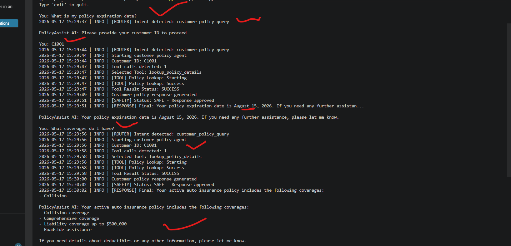
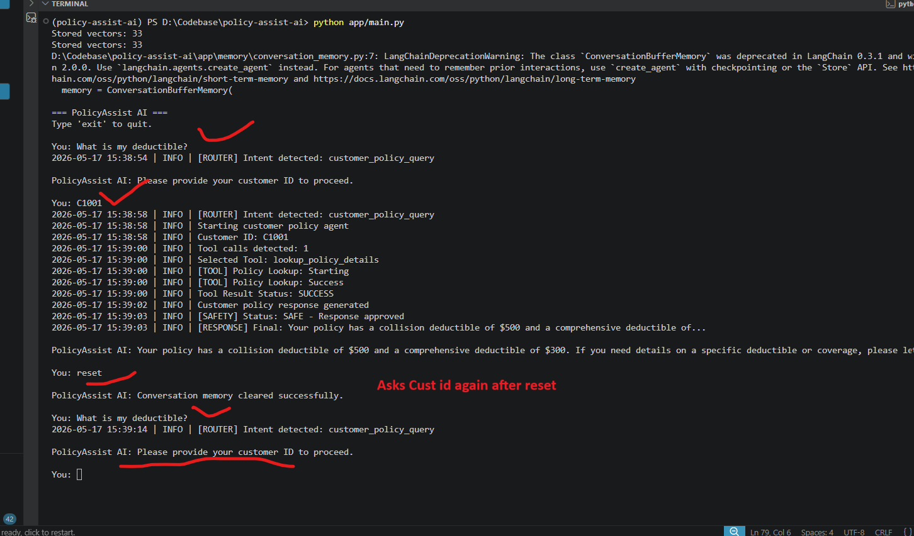
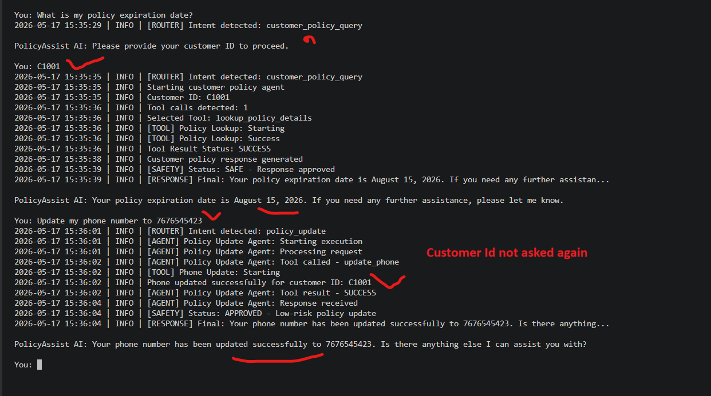

# Phase 6 — Planning, Memory & Context

## Table of Contents

1. [Introduction](#1-introduction)
2. [Phase 6 Requirements Coverage](#2-phase-6-requirements-coverage)
3. [Project Structure Changes](#3-project-structure-changes)
4. [Architecture Overview](#4-architecture-overview)
5. [Conversation Memory Architecture](#5-conversation-memory-architecture)
6. [Memory-Aware Routing Workflow](#6-memory-aware-routing-workflow)
7. [Multi-Step Reasoning & Workflow Reconstruction](#7-multi-step-reasoning--workflow-reconstruction)
8. [Short-Term Memory Handling](#8-short-term-memory-handling)
9. [Memory Retention & Reset Behaviour](#9-memory-retention--reset-behaviour)
10. [Improved Multi-Turn Conversations](#10-improved-multi-turn-conversations)
11. [Routing Failure Analysis & Recovery](#11-routing-failure-analysis--recovery)
12. [Technical Challenges & Engineering Decisions](#12-technical-challenges--engineering-decisions)
13. [Phase Summary](#13-phase-summary)

---

# 1. Introduction

Phase 6 introduced conversational memory, contextual orchestration, and multi-turn workflow continuity into PolicyAssist AI.

Earlier phases relied on stateless request-response orchestration where every user query was treated independently.

This phase evolved the system into a memory-aware conversational workflow capable of:

- maintaining session continuity
- reconstructing pending workflows
- preserving customer authentication state
- continuing failed operational workflows
- supporting contextual follow-up handling
- enabling memory-aware routing
- improving multi-turn interaction quality

Unlike autonomous planning systems, the implementation intentionally uses:

- controlled conversational memory
- memory-aware routing
- deterministic orchestration
- contextual workflow reconstruction

to improve:

- operational reliability
- explainability
- debugging visibility
- workflow continuity
- conversational quality

---

# 2. Phase 6 Requirements Coverage

## Official Phase 6 Requirements

| Requirement | Status |
|---|---|
| Introduce multi-step reasoning | Completed |
| Add memory handling | Completed |
| Improve multi-turn conversations | Completed |
| Implement planning/reasoning logic | Completed |
| Add short-term memory | Completed |
| Define memory retention/reset behaviour | Completed |
| Demonstrate improved conversation quality | Completed |

---

# 3. Project Structure Changes

## New Memory Layer

```text
app/memory/
│
└── conversation_memory.py
```

### What Changed

A dedicated memory layer was introduced using:

```python
ConversationBufferMemory
```

The file now handles:

- storing user inputs
- storing AI responses
- retrieving conversation history
- clearing conversational memory
- managing session continuity

### Why It Was Added

This file was introduced to:

- enable short-term conversational memory
- support contextual routing
- maintain workflow continuity
- preserve customer authentication state
- improve multi-turn conversations
- support memory reset functionality

Without this layer, every user message would continue behaving as an isolated stateless query.

---

## Updated Agents & Orchestration

```text
app/
│
├── main.py
│
├── agents/
│   └── intent_router_agent.py
│
├── prompts/
│   └── router_prompts.py
│
└── agents/
    └── policy_update_agent.py
```

---

## main.py

### What Changed

The orchestration workflow was updated to:

- initialize conversational memory
- save user messages into memory
- save AI responses into memory
- retrieve conversation history
- support memory reset behaviour
- pass conversational history into routing logic
- pass conversational history into policy update workflows

### Why It Was Updated

These changes enabled:

- memory-aware orchestration
- multi-turn workflow continuity
- customer authentication persistence
- contextual routing
- conversational follow-up handling
- session reset management

This file became the central orchestrator for conversational memory management.

---

## intent_router_agent.py

### What Changed

The routing agent was upgraded to:

- receive conversation history
- perform contextual reasoning
- reconstruct pending workflows
- reuse customer authentication from memory
- return reconstructed executable queries
- support memory-aware routing decisions

The routing response was also changed from:
- simple intent string

to:
- structured JSON response

containing:
- intent
- customer_id
- missing_info
- query_to_process

### Why It Was Updated

These changes enabled:

- contextual intent routing
- authentication continuation
- multi-step reasoning
- follow-up workflow reconstruction
- conversational continuity
- memory-aware orchestration

Without these changes, the router could not continue interrupted workflows.

---

## router_prompts.py

### What Changed

The router prompt was redesigned to include:

- conversation history
- contextual reasoning instructions
- authentication continuation logic
- workflow reconstruction rules
- follow-up handling guidance
- structured JSON response format

The prompt now explicitly instructs the LLM to:

- inspect prior conversation history
- recover customer identity from memory
- identify pending workflows
- reconstruct operational requests
- continue interrupted tasks

### Why It Was Updated

These changes enabled the router to perform:

- memory-aware reasoning
- contextual workflow continuation
- customer session continuity
- multi-step conversational orchestration

This became the core reasoning layer for conversational continuity.

---

## policy_update_agent.py

### What Changed

The policy update agent was updated to:

- receive conversation history
- use contextual information during update workflows
- recover missing operational details from memory
- continue interrupted update operations

The agent prompt was also updated with instructions such as:

```text
You can retrieve the required information like latest email or phone from history to pass to tool.
```

### Why It Was Updated

These changes enabled:

- contextual update continuation
- failed workflow recovery
- conversational operational continuity
- memory-aware tool execution

This improvement was critical for resolving routing continuity failures observed before Phase 6.

---

## conversation_memory.py

```python
from langchain_classic.memory import ConversationBufferMemory

# ---------------------------------------------------
# Shared Conversation Memory
# ---------------------------------------------------

memory = ConversationBufferMemory(
    return_messages=True
)


# ---------------------------------------------------
# Save Interaction
# ---------------------------------------------------

def save_user_input(user_input: str):
    """
    Saves user input into conversation memory.
    """

    memory.chat_memory.add_user_message(user_input)

def save_ai_response(ai_response: str):
    """
    Saves AI response into conversation memory.
    """

    memory.chat_memory.add_ai_message(ai_response)


# ---------------------------------------------------
# Get Conversation History
# ---------------------------------------------------

def get_conversation_history():
    """
    Returns conversation history.
    """

    return memory.load_memory_variables({})


# ---------------------------------------------------
# Clear Conversation Memory
# ---------------------------------------------------

def clear_conversation_memory():
    """
    Clears all conversation memory.
    """

    memory.clear()
```

---

## router_prompts.py
```python

INTENT_ROUTER_PROMPT = """
You are an Intent Routing Agent for an insurance support AI system.

Your responsibilities:

1. Detect customer intent
2. Determine whether additional information is required
3. Extract customer ID from conversation history if already provided
4. Handle follow-up authentication flows intelligently
5. Return the actual query that should now be processed

Available Intent Categories:

1. policy_information
- Questions about coverage, exclusions, deductibles, benefits, waiting periods, policy terms

2. claim_support
- Claims guidance, reimbursement, claim rejection explanations, claim status, claim documents

3. policy_update
- Requests to update email, phone number

4. restricted_operation
- Requests involving:
  - claim approval/rejection
  - premium reduction
  - deductible waivers
  - policy cancellation
  - effective date changes
  - unauthorized operational actions

5. customer_policy_query
- Questions about the customer's own policy details
- Queries containing:
  - my policy
  - my deductible
  - my vehicles
  - my expiry date
  - my coverage
  - my account

Examples:
- What is my policy expiry date?
- What vehicles are insured under my policy?
- Is my policy active?
- What is my deductible?

6. general_query
- Insurance-related questions that do not fit above categories

Conversation History:
{conversation_history}

Current User Query:
{user_query}

IMPORTANT LOGIC:

AUTHENTICATION REQUIRED FOR:
- policy_update
- customer_policy_query

RULES:

1. If the current query itself contains a valid customer ID:
   - extract and return it

2. If customer ID already exists in conversation history:
   - reuse it

3. If the current message is ONLY a customer ID reply:
   - identify the last pending authenticated request from conversation history
   - return:
     - the intent of that pending request
     - the provided customer ID
     - the original pending query as "query_to_process"

Example:
History:
User: What is my policy expiry date?
Assistant: Please provide your customer ID to proceed.

Current Query:
C1001

Return:
{{
    "intent": "customer_policy_query",
    "customer_id": "C1001",
    "missing_info": "",
    "query_to_process": "What is my policy expiry date?"
}}

4. For policy_update or customer_policy_query:
   - if customer ID is NOT available:
     set:
     "missing_info": "Please provide your customer ID to proceed."

5. If no pending query exists:
   - use current user query as "query_to_process"

6. For all other intents:
   - "missing_info" must be empty string ""

7. Return ONLY valid JSON
8. Do NOT include explanations
9. Do NOT include markdown

Response Format:
{{
    "intent": "customer_policy_query",
    "customer_id": "C1001",
    "missing_info": "",
    "query_to_process": "What is my policy expiry date?"
}}

Another Example:
{{
    "intent": "policy_update",
    "customer_id": "",
    "missing_info": "Please provide your customer ID to proceed.",
    "query_to_process": "Update my phone number"
}}
"""

```

---

## intent_router_agent.py

```python
from llm.llm_client import LLMClient
from prompts.router_prompts import INTENT_ROUTER_PROMPT
from logs.logger import get_logger
import json


logger = get_logger()
llm_client = LLMClient()


VALID_INTENTS = {
    "policy_information",
    "claim_support",
    "policy_update",
    "restricted_operation",
    "general_query",
    "customer_policy_query",
    "unknown",
}


def detect_intent(user_input: str, conversation_history: str) -> str:
    """
    Detects user intent using LLM classification.
    """

    try:
        prompt = INTENT_ROUTER_PROMPT.format(
            user_query=user_input,
            conversation_history=conversation_history
        )

        response = llm_client.ask(prompt)

        result = json.loads(response)
        intent = result.get("intent", "unknown").lower().strip()

        if intent not in VALID_INTENTS:
            intent = "unknown"

        result["intent"] = intent
        logger.info(f"[ROUTER] Intent detected: {intent}")
        return result

    except Exception as error:
        logger.error(f"[ROUTER] Failed to detect intent: {str(error)}")
        return {
            "intent": "unknown",
            "customer_id": None,
            "requires_customer_id": False
        }
```

---

## main.py

```python
from agents.intent_router_agent import detect_intent
from agents.policy_information_agent import handle_policy_information_query
from agents.claim_support_agent import handle_claim_support_query
from agents.policy_update_agent import handle_policy_update_request
from agents.general_query_agent import handle_general_query
from agents.customer_policy_agent import handle_customer_policy_query
from agents.safety_review_agent import review_response
from logs.logger import get_logger
from memory.conversation_memory import (
    save_user_input,
    save_ai_response,
    get_conversation_history,
    clear_conversation_memory
)

logger = get_logger()

pending_query = None

def process_user_query(user_input: str) -> str:
    """
    Main orchestration workflow for the baseline
    multi-agent insurance support system.
    """
    global pending_query

    if user_input.lower() == "reset":
        clear_conversation_memory()
        return "Conversation memory cleared successfully."

    save_user_input(user_input)
    # init conversation history
    conversation_history = get_conversation_history()

    # Step 1 — Detect intent
    routing_result = detect_intent(user_input, conversation_history)
    intent = routing_result.get("intent", "unknown")
    customer_id = routing_result.get("customer_id")
    missing_info = routing_result.get("missing_info", "")
    user_input = routing_result.get("query_to_process", user_input)

    if missing_info:        
        save_ai_response(missing_info)
        return missing_info
    

    # Step 2 — Route to appropriate agent
    # Policy Information Agent
    if intent == "policy_information":
        response = handle_policy_information_query(user_input)

    # Customer Policy Query Agent
    elif intent == "customer_policy_query":
        response = handle_customer_policy_query(user_input, customer_id=customer_id)

    # Claim Support Agent
    elif intent == "claim_support":
        response = handle_claim_support_query(user_input)

    # Policy Update Agent
    elif intent == "policy_update":
        response = handle_policy_update_request(user_input, customer_id=customer_id, conversation_history=conversation_history)

    # Restricted Operations
    elif intent == "restricted_operation":
        response = "Restricted operation detected."

    # General Query Agent
    else:
        response = handle_general_query(user_input)

    # Step 3 — Safety Review
    safe_response = review_response(user_input, intent, response)
    logger.info(f"[RESPONSE] Final: {safe_response[:80]}...")
    save_ai_response(safe_response)
    return safe_response


def main():
    """
    CLI entry point for PolicyAssist AI.
    """

    print("\n=== PolicyAssist AI ===")
    print("Type 'exit' to quit.\n")

    while True:
        user_input = input("You: ")

        if user_input.lower() == "exit":
            print("PolicyAssist AI: Goodbye!")
            break

        response = process_user_query(user_input)

        print(f"\nPolicyAssist AI: {response}\n")


if __name__ == "__main__":
    main()
```

---

# 4. Architecture Overview

## Phase 6 Memory-Aware Architecture

```text
Customer Query
        ↓
Conversation Memory
        ↓
Intent Router Agent
        ↓
Contextual Reasoning
        ↓
Workflow Reconstruction
        ↓
──────────────────────────────────────
│                 │
↓                 ↓
Customer           Policy
Policy Agent       Update Agent
│                 │
│                 ├── update_email_tool
│                 └── update_phone_tool
│
└── lookup_policy_details
        ↓
Tool Result
        ↓
Grounded Response
        ↓
Safety Review Agent
        ↓
Conversation Memory Update
        ↓
Final Response
```

---

# 5. Conversation Memory Architecture

## Implemented Memory Type

The system uses:

```python
ConversationBufferMemory
```

implemented through LangChain classic memory support.

---

## Memory Responsibilities

The memory layer stores:

- user messages
- AI responses
- customer authentication prompts
- workflow continuation context
- operational follow-up state

---

## Memory Capabilities

| Capability | Description |
|---|---|
| Conversation continuity | Maintains prior interaction context |
| Customer continuity | Avoids repeated authentication |
| Workflow reconstruction | Recovers incomplete workflows |
| Cross-agent continuity | Shares conversational state across agents |
| Follow-up reasoning | Supports contextual routing |

---

# 6. Memory-Aware Routing Workflow

## Overview

The intent router was upgraded to become memory-aware.

The router now receives:

- current user query
- prior conversation history

and performs contextual reasoning before returning:

- detected intent
- customer identity
- missing information
- reconstructed workflow query

---

## Example User Query

```text
What is my policy expiration date?
```

---

## Workflow Behaviour

The system:

- detected customer policy intent
- requested customer authentication
- stored customer ID in conversational memory
- reused customer identity for follow-up queries
- avoided repeated authentication prompts

---

## Execution Evidence



---

# 7. Multi-Step Reasoning & Workflow Reconstruction

## Overview

Phase 6 introduced contextual reasoning into the orchestration workflow.

The router now performs reasoning across multiple steps:

1. inspect current user input
2. analyze conversation history
3. determine authentication status
4. recover pending workflows
5. reconstruct executable operations
6. continue interrupted workflows

---

## Example User Query

```text
Update my phone to 1234
```

---

## Workflow Behaviour

The system:

- detected invalid phone format
- preserved failed workflow context
- retained customer authentication
- reconstructed workflow using follow-up input
- resumed pending update operation

Follow-up input:

```text
9924154326
```

was successfully interpreted as continuation of the failed phone update workflow.

---

## Execution Evidence


---

# 8. Short-Term Memory Handling

## Overview

Phase 6 introduced shared short-term conversational memory across the entire orchestration workflow.

Conversation history remains active during the current session and is reused by:

- intent routing
- policy retrieval workflows
- update operations
- follow-up queries

---

## Memory Update Flow

### User Input

```python
save_user_input(user_input)
```

### AI Response

```python
save_ai_response(safe_response)
```

---

## Example User Query

```text
What is my policy expiration date?
```

Follow-up:

```text
What coverages do I have?
```

---

## Workflow Behaviour

The system:

- remembered authenticated customer identity
- reused stored conversation history
- continued customer policy workflow
- avoided repeated customer ID prompts

---

## Execution Evidence


---

# 9. Memory Retention & Reset Behaviour

## Overview

Phase 6 introduced controlled conversational memory lifecycle management.

A dedicated reset workflow was implemented to:

- clear conversational state
- remove stored customer identity
- reset workflow continuity
- restart authentication flow

---

## Reset Command

```text
reset
```

---

## Reset Behaviour

After reset:

- customer authentication is removed
- conversation continuity is cleared
- routing context is reset
- future requests require authentication again

---

## Example User Query

```text
reset
```

---

## Workflow Behaviour

The system:

- cleared active conversational memory
- removed stored customer session state
- restarted contextual routing workflow

---

## Execution Evidence



---

# 10. Improved Multi-Turn Conversations

## Overview

Phase 6 significantly improved conversational continuity and contextual follow-up handling.

Earlier phases treated every message independently.

Phase 6 introduced:

- contextual continuity
- conversational persistence
- authentication reuse
- cross-agent workflow continuation

---

## Example User Query

```text
What is my policy expiration date?
```

Follow-up:

```text
Update my phone number to 7676545423
```

---

## Workflow Behaviour

The system:

- reused stored customer authentication
- preserved conversational context
- routed request to Policy Update Agent
- completed phone update without reauthentication

---

## Execution Evidence



---

# 11. Routing Failure Analysis & Recovery

## Failure Before Memory-Aware Routing

Earlier orchestration treated follow-up inputs independently.

### Example Failure

```text
User: update my phone to 1234
```

Phone validation failed.

User then replied:

```text
9924154326
```

---

## Failure Behaviour

The system:

- lost workflow continuity
- restarted routing
- treated the number as standalone input
- incorrectly routed request to general_query

---

## Execution Evidence

Before Fix


---

## Fix Implemented

Phase 6 introduced:

- conversation memory
- memory-aware routing
- contextual reconstruction
- pending workflow recovery

---

## Recovery Behaviour

The system successfully:

- recognized workflow continuation
- recovered failed update operation
- reused customer authentication
- reconstructed executable workflow
- completed phone update successfully

---

## Execution Evidence

After Fix


---

# 12. Technical Challenges & Engineering Decisions

## Challenge 1 — Stateless Workflow Failure

### Example

```text
User: 9924154326
```

### Earlier Behaviour

The number was incorrectly routed as:

```text
general_query
```

### Fix

Memory-aware routing and workflow reconstruction were introduced.

---

## Challenge 2 — Authentication Continuity

### Earlier Limitation

Customer ID had to be repeatedly provided for every operation.

### Fix

Conversation memory now preserves customer authentication context across interactions.

---

## Challenge 3 — Controlled Memory Lifecycle

### Requirement

Memory needed controlled retention and reset behaviour.

### Fix

A dedicated reset workflow was implemented using:

```python
clear_conversation_memory()
```

---

# 13. Phase Summary

Phase 6 successfully transformed PolicyAssist AI from a stateless orchestration system into a contextual conversational AI workflow with memory-aware reasoning.

The implementation introduced:

- conversational memory
- contextual routing
- workflow reconstruction
- multi-turn continuity
- customer authentication persistence
- memory-aware orchestration
- controlled memory reset

The system now supports:

- contextual follow-up handling
- conversational continuity
- workflow recovery
- memory-aware routing
- improved operational reliability

while still maintaining:

- deterministic orchestration
- explicit governance controls
- controlled operational execution
- explainable workflow behaviour