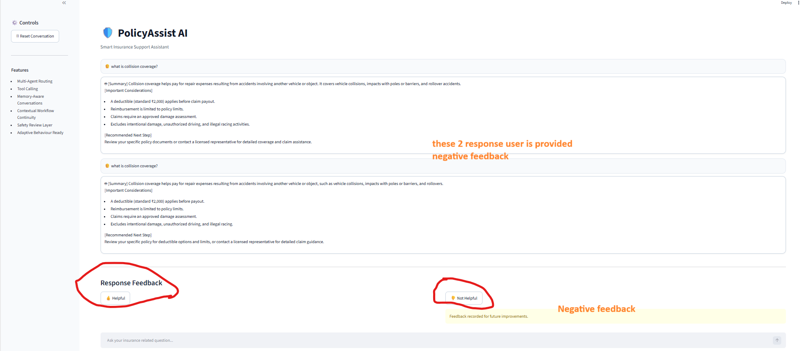
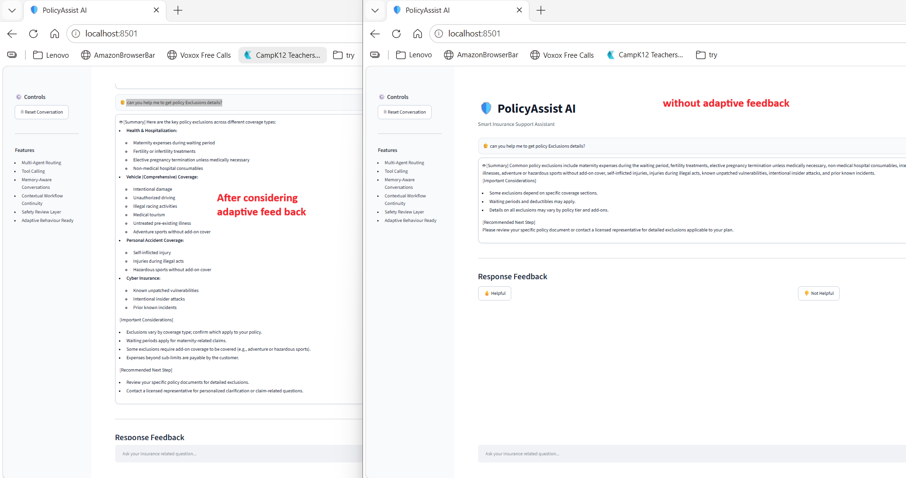
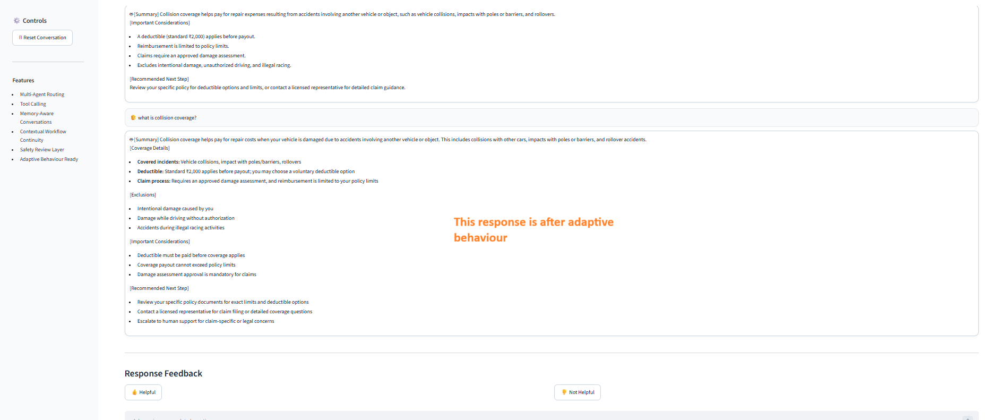
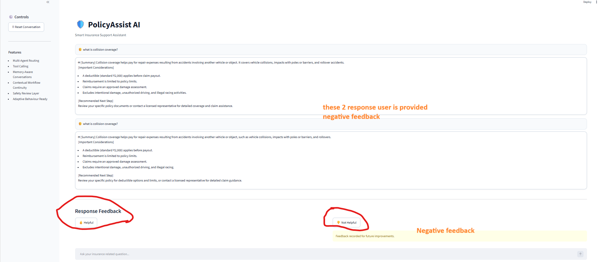
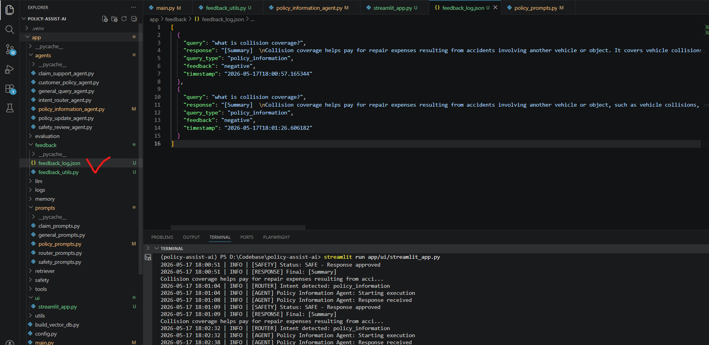

# Phase 7: Adaptive Behaviour

## Table of Contents

1. [Overview](#1-overview)
2. [Phase Objectives](#2-phase-objectives)
3. [Project Structure Changes](#3-project-structure-changes)
4. [Feedback Collection Workflow](#4-feedback-collection-workflow)
5. [Adaptive Behaviour Logic](#5-adaptive-behaviour-logic)
6. [Behaviour Modification Strategy](#6-behaviour-modification-strategy)
7. [Before vs After Behaviour Comparison](#7-before-vs-after-behaviour-comparison)
8. [Feedback Collection UI](#8-feedback-collection-ui)
9. [Feedback Storage Persistence](#9-feedback-storage-persistence)
10. [Code Changes & Engineering Justification](#10-code-changes--engineering-justification)
11. [Phase 7 Requirements Coverage](#11-phase-7-requirements-coverage)

---

# 1. Overview

Phase 7 introduced adaptive behaviour into the PolicyAssist AI system.

The system now:
- collects user feedback
- stores historical feedback
- identifies repeated dissatisfaction patterns
- dynamically modifies future LLM behaviour
- generates richer and more educational responses after repeated negative feedback

This phase demonstrates practical feedback-driven AI adaptation without requiring model retraining.

---

# 2. Phase Objectives

This phase focused on:

- Introducing feedback signals
- Persisting user feedback
- Dynamically adjusting agent behaviour
- Demonstrating before vs after behavioural improvement
- Making adaptation explainable and reproducible

---

# 3. Project Structure Changes

## New Feedback Layer

```text
app/
│
├── feedback/
│   ├── feedback_utils.py
│   └── feedback_log.json
│
├── ui/
│   └── streamlit_app.py
```

## Updated Agent & Prompt Files

```text
app/
│
├── prompts/
│   └── policy_prompts.py
│
└── agents/
    └── policy_information_agent.py
```

---

## File Change Summary

### `app/feedback/feedback_utils.py`

Purpose:
- Store user feedback
- Track historical dissatisfaction
- Trigger adaptive behaviour thresholds

[Click here to open file](../../app/feedback/feedback_utils.py)

---

### `app/feedback/feedback_log.json`

Purpose:
- Persist user feedback history
- Store query type, feedback status, and timestamps

[Click here to open file](../../app/feedback/feedback_log.json)

---

### `app/ui/streamlit_app.py`

Purpose:
- Introduced Streamlit-based interactive UI
- Added 👍 / 👎 feedback controls
- Enabled feedback collection workflow
- Added memory-aware conversational interface

[Click here to open file](../../app/ui/streamlit_app.py)

---

### `app/prompts/policy_prompts.py`

Purpose:
- Added adaptive prompt instruction support
- Allowed dynamic response formatting changes
- Enabled richer response generation after repeated negative feedback

[Click here to open file](../../app/prompts/policy_prompts.py)

---

### `app/agents/policy_information_agent.py`

Purpose:
- Added adaptive behaviour decision logic
- Dynamically injected adaptive prompt instructions
- Enabled behaviour modification using historical feedback patterns

[Click here to open file](../../app/agents/policy_information_agent.py)

---

# 4. Feedback Collection Workflow

The Streamlit interface introduced explicit user feedback collection.

After every valid agent response:
- users can provide 👍 Helpful feedback
- or 👎 Not Helpful feedback

Feedback is then:
- stored in JSON format
- associated with query category
- reused for future behavioural adaptation

The system intentionally ignores:
- system messages
- safety refusals
- unknown routing states

to prevent invalid adaptation behaviour.

---

# 5. Adaptive Behaviour Logic

Adaptive behaviour is activated only when repeated dissatisfaction occurs.

## Adaptation Rule

```text
If negative feedback count >= 2
→ adaptive behaviour instructions activate
```

Refer `should_use_adaptive_response` function from [feedback_utils.py](../../app/feedback/feedback_utils.py)

The adaptation logic:
- analyzes historical feedback
- identifies repeated dissatisfaction
- injects additional behavioural instructions into prompts
- modifies future response generation style

This allows the system to:
- remain stable
- avoid overreacting to single accidental feedback
- improve responses only after consistent dissatisfaction patterns

---

# 6. Behaviour Modification Strategy

When adaptive behaviour activates, the system dynamically changes:

| Before Adaptation | After Adaptation |
|---|---|
| Concise answers | Detailed educational responses |
| Minimal formatting | Structured multi-section formatting |
| Basic summaries | Expanded explanations |
| Limited guidance | Practical examples and exclusions |
| Static prompting | Dynamic prompt injection |

The adapted responses include:
- richer explanations
- additional sections
- practical examples
- expanded guidance
- clearer exclusions and deductible explanations

---

# 7. Before vs After Behaviour Comparison

## Before Adaptation

The system generated shorter and concise responses.

Characteristics:
- limited explanation depth
- minimal structure
- concise summaries only

### Execution Evidence



---

## After Repeated Negative Feedback

After multiple negative feedback signals:
- adaptive prompt instructions activated
- the system generated more detailed responses
- educational formatting improved significantly

Characteristics:
- structured sections
- examples
- exclusions
- deductible explanations
- expanded considerations
- richer customer guidance

---

## Adaptive Behaviour Workflow

The system progressively improved response quality after repeated negative feedback signals.

Behaviour evolution included:
- richer formatting
- educational explanations
- expanded sections
- practical examples
- deductible explanations
- exclusion breakdowns

The final adaptive response demonstrated:
- clearer structure
- better readability
- stronger customer guidance
- more explainable insurance details

### Execution Evidence



---

## Final Adaptive Response

### Execution Evidence



---

# 8. Feedback Collection UI

The Streamlit interface introduced interactive feedback collection capabilities.

After every valid response:
- users can provide 👍 Helpful feedback
- or 👎 Not Helpful feedback

The feedback interface:
- improves demo usability
- enables adaptation tracking
- supports future behavioural improvements

The system intentionally excludes:
- system responses
- reset operations
- restricted operations
- unknown routing states

from adaptive learning to maintain reliable behaviour.

### Execution Evidence



---

# 9. Feedback Storage Persistence

All user feedback is persisted inside:

[Click here for Feedback Storage File](../../app/feedback/feedback_log.json)

The feedback storage structure contains:

```json
{
    "query": "what is collision coverage?",
    "response": "agent response",
    "query_type": "policy_information",
    "feedback": "negative",
    "timestamp": "2026-05-17T18:12:15.106341"
}
```

## Field Explanation

| Field | Purpose |
|---|---|
| query | Original user query |
| response | Generated AI response |
| query_type | Stores detected intent category |
| feedback | Stores positive or negative feedback |
| timestamp | Records interaction time |

---

## Why `query_type` Was Added

The `query_type` field enables category-specific adaptive behaviour.

This allows:
- policy information feedback to influence only policy information responses
- claim support feedback to remain isolated
- safer and more explainable behavioural adaptation

Without intent-aware categorization:
- all feedback would affect all response types
- adaptation behaviour would become unreliable

This design ensures:
- controlled adaptation
- stable behaviour
- explainable feedback-driven learning

### Execution Evidence



---

# 10. Code Changes & Engineering Justification

## Adaptive Prompt Injection

### File:
`app/prompts/policy_prompts.py`

### Code Changes

```python
Adaptive Behaviour Instructions:
{adaptive_instruction}

If adaptive behaviour instructions are active:
- provide richer formatting
- add additional explanation sections
- provide clearer examples

Response Constraints:
- Maximum 100 words unless adaptive behaviour instructions require additional detail
```

### Why This Change Was Added

This update enabled:
- dynamic prompt adaptation
- structured behavioural modifications
- richer response formatting
- controlled educational response expansion

The prompt now supports adaptive instruction injection while maintaining:
- retrieval grounding
- safety-first behaviour
- hallucination prevention

---

## Adaptive Behaviour Decision Logic

### File:
`app/agents/policy_information_agent.py`

### Code Changes

```python
adaptive_instruction = "No adaptive behaviour required."

if should_use_adaptive_response("policy_information"):

    adaptive_instruction = """
        Previous responses for policy information
        queries received repeated negative feedback.

        IMPORTANT:
        The customer expects a more detailed,
        better structured, and easier to understand response.

        Response Requirements:
        - Add clear section headings
        - Use bullet points
        - Include practical examples
        - Explain exclusions separately
        - Explain deductibles separately
        - Expand important considerations
        - Provide richer customer guidance
        - Use a more educational explanation style

        You may provide longer responses when needed.
    """
```

### Why This Change Was Added

This logic introduced:
- feedback-aware orchestration
- dynamic behaviour modification
- adaptive response generation

The agent now:
- evaluates historical dissatisfaction
- activates adaptation only after repeated negative feedback
- modifies future prompt behaviour dynamically

This prevents:
- overreaction to isolated feedback
- unstable behavioural changes
- uncontrolled prompt adaptation

---

# 11. Phase 7 Requirements Coverage

| Requirement | Status | Evidence |
|---|---|---|
| Introduce feedback signals | ✅ Completed | Streamlit 👍 / 👎 controls |
| Store feedback for future interactions | ✅ Completed | feedback_log.json |
| Modify behaviour based on feedback | ✅ Completed | Adaptive prompt injection |
| Demonstrate before vs after behaviour | ✅ Completed | Comparison screenshots |
| Explain adaptation logic | ✅ Completed | Adaptive workflow documentation |
| Behaviour adjustment logic | ✅ Completed | policy_information_agent.py |
| Feedback persistence | ✅ Completed | JSON feedback storage |
| Adaptive response generation | ✅ Completed | Dynamic behavioural modifications |