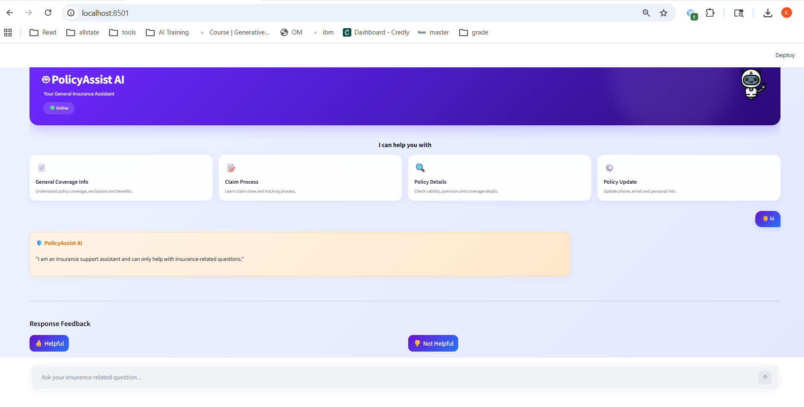
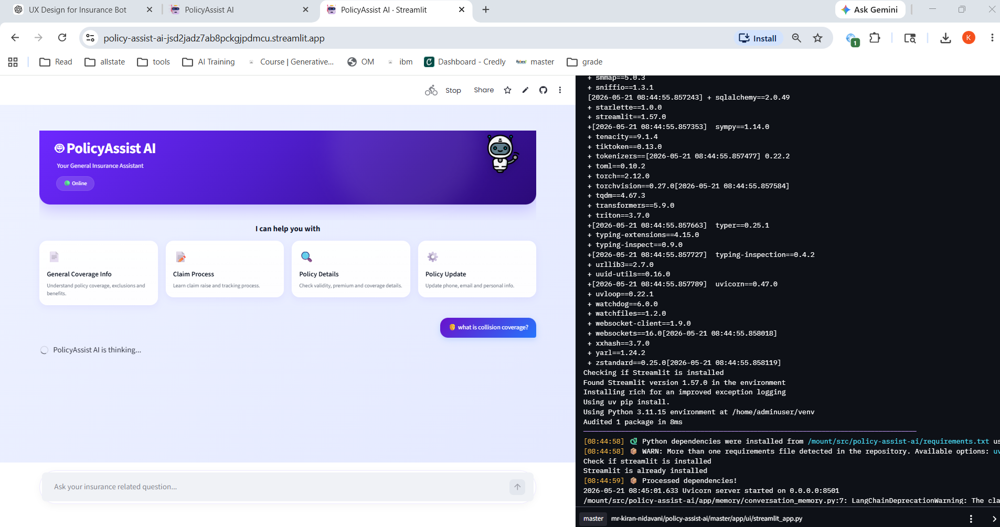
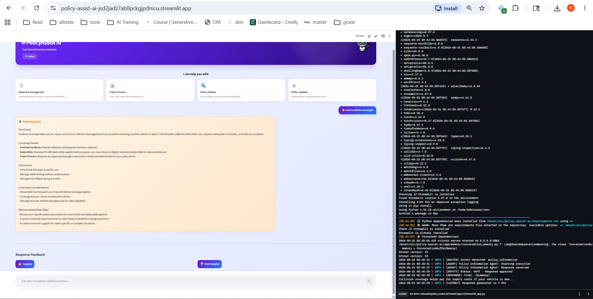
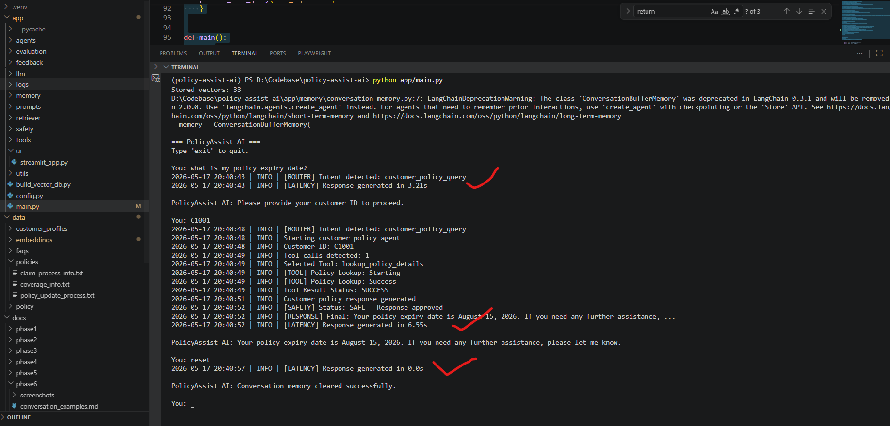
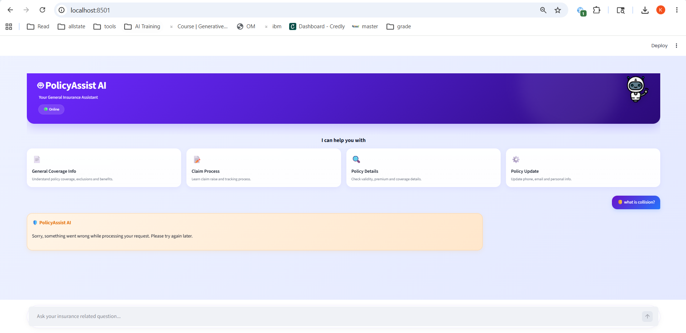
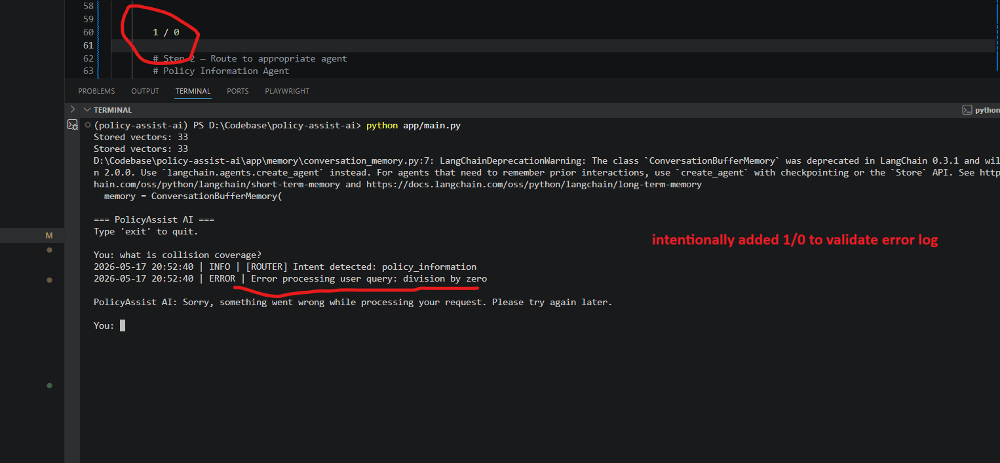
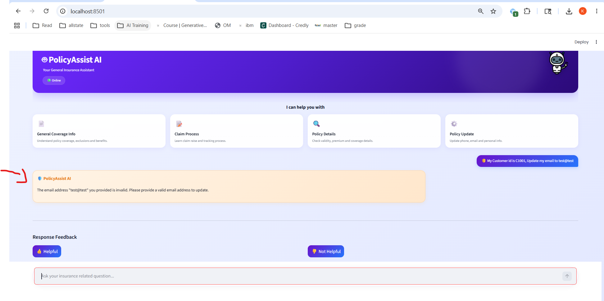
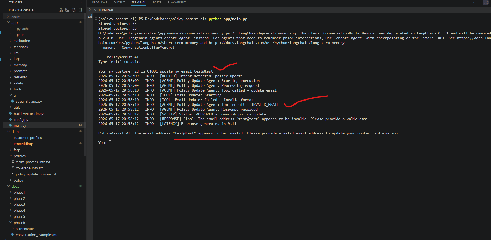
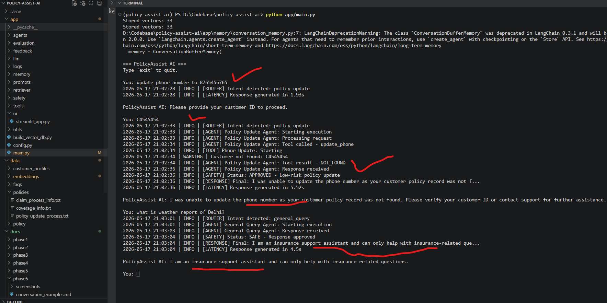

# Phase 8: Deployment Readiness

## Table of Contents

* [1. Overview](#1-overview)
* [2. Phase Objectives](#2-phase-objectives)
* [3. Deployment Architecture](#3-deployment-architecture)
* [4. Packaging & Reproducibility](#4-packaging--reproducibility)
* [5. Environment Configuration](#5-environment-configuration)
* [6. Local Deployment Steps](#6-local-deployment-steps)
* [7. Cloud Deployment](#7-cloud-deployment)
* [8. Logging & Tracing](#8-logging--tracing)
* [9. Latency Monitoring](#9-latency-monitoring)
* [10. Runtime Error Handling](#10-runtime-error-handling)
* [11. Graceful Failure Handling](#11-graceful-failure-handling)
* [12. Deployment Issues & Resolutions](#12-deployment-issues--resolutions)
* [13. Updated Files](#13-updated-files)
* [14. Deployment Assumptions & Limitations](#14-deployment-assumptions--limitations)
* [15. Phase 8 Requirements Coverage](#15-phase-8-requirements-coverage)

---

# 1. Overview

Phase 8 focused on preparing the PolicyAssist AI system for deployment readiness.

This phase introduced:

* dependency packaging
* environment-based configuration
* local and cloud deployment workflows
* runtime logging and tracing
* latency monitoring
* graceful failure handling
* runtime error capture

The system was successfully deployed locally and on Streamlit Community Cloud.

---

# 2. Phase Objectives

Objectives completed in this phase:

* Package the application for deployment
* Add logging and execution tracing
* Capture runtime latency and error logs
* Handle runtime failures gracefully
* Deploy locally and on the cloud
* Document deployment assumptions and limitations

---

# 3. Deployment Architecture

| Layer           | Technology                | Purpose                        |
| --------------- | ------------------------- | ------------------------------ |
| Frontend        | Streamlit                 | User interface                 |
| Backend         | Python + LangChain        | Agent orchestration            |
| LLM Provider    | OpenAI API                | Response generation            |
| Vector Database | ChromaDB                  | Retrieval-Augmented Generation |
| Logging         | Python logging            | Runtime observability          |
| Deployment      | Streamlit Community Cloud | Cloud hosting                  |

---

# 4. Packaging & Reproducibility

The project was packaged for reproducible deployment using:

* Git version control
* requirements.txt dependency management
* environment-based configuration
* modular project structure
* Streamlit application entrypoint

## Requirements File

File:

```text
requirements.txt
```

Code Snippet:

```txt
streamlit
openai
langchain
langchain-community
langchain-openai
langchain-chroma
langchain-classic
chromadb
python-dotenv
tiktoken
pydantic
numpy
pandas
pypdf
rapidfuzz
loguru
transformers
torch
torchvision
protobuf==3.20.3
```

Why this was added:

* defines reproducible runtime dependencies
* supports local and cloud deployment
* removes unnecessary packages
* improves deployment stability

---

# 5. Environment Configuration

Environment variables were externalized using `.env`.

## Environment Example File

File:

```text
.env_example
```

Code Snippet:

```env
OPENAI_API_BASE=""
OPENAI_API_KEY=""
OPENAI_MODEL="gpt-4.1-mini"

TEMPERATURE="0.3"
MAX_TOKENS="500"

CHUNK_SIZE="800"
CHUNK_OVERLAP="150"

POLICY_DATA_PATH="data/policies"
VECTOR_DB_PATH="data/embeddings"

CUSTOMER_POLICY_DATA_PATH="data/customer_profiles/customer_policies.json"

FEEDBACK_LOG_PATH="app/feedback/feedback_log.json"

APPLY_ADAPTIVE_AFTER_NEGATIVE_FEEDBACK_COUNT=2
```

Why this was added:

* separates secrets from source code
* improves deployment portability
* enables environment-specific configuration
* improves security and reproducibility

---

# 6. Local Deployment Steps

## Step 1 — Clone Repository

```bash
git clone <repository_url>
```

## Step 2 — Navigate to Project

```bash
cd policy-assist-ai
```

## Step 3 — Create Virtual Environment

```bash
python -m venv .venv
```

## Step 4 — Activate Virtual Environment

Windows PowerShell:

```bash
.venv\Scripts\Activate.ps1
```

## Step 5 — Install Dependencies

```bash
pip install -r requirements.txt
```

## Step 6 — Configure Environment Variables

Create `.env` file from:

```text
.env_example
```

Update:

```env
OPENAI_API_KEY="your_api_key"
```

## Step 7 — Run Streamlit Application

```bash
streamlit run app/ui/streamlit_app.py
```

## Step 8 — Run CLI Application

```bash
python app/main.py
```

### Local Deployment Evidence



---

# 7. Cloud Deployment

The application was deployed using Streamlit Community Cloud directly from GitHub.

Deployment URL:

https://policy-assist-ai-jsd2jadz7ab8pckgjpdmcu.streamlit.app/

## Cloud Deployment Steps

### Step 1 — Push Code To GitHub

```bash
git add .
git commit -m "Deployment ready"
git push
```

### Step 2 — Open Streamlit Community Cloud

```text
https://share.streamlit.io/
```

### Step 3 — Connect GitHub Repository

Select:

* repository
* branch
* deployment file

Main file path:

```text
app/ui/streamlit_app.py
```

### Step 4 — Configure Secrets

Using:

```text
Advanced Settings → Secrets
```

Example:

```toml
OPENAI_API_KEY = "your_key"
OPENAI_MODEL = "gpt-4.1-mini"
```

### Step 5 — Deploy Application

Streamlit automatically:

* installs dependencies
* creates environment
* deploys application

### Cloud Deployment Evidence





---

# 8. Logging & Tracing

The system implements lightweight execution tracing using structured logs.

Execution tracing includes:

* routing decisions
* agent execution flow
* tool invocation lifecycle
* safety review status
* runtime failures
* latency measurements

Example Logs:

```text
[ROUTER] Intent detected: policy_update
[AGENT] Policy Update Agent: Starting execution
[TOOL] Phone Update: Starting
[SAFETY] Status: APPROVED
[LATENCY] Response generated in 5.52s
```

Why this was added:

* improves runtime observability
* supports debugging and monitoring
* enables execution flow visibility

### Logging & Tracing Evidence



---

# 9. Latency Monitoring

Latency monitoring was added to measure response generation time.

Example:

```text
[LATENCY] Response generated in 6.55s
```

Why this was added:

* helps monitor runtime performance
* enables operational visibility
* supports deployment monitoring

### Latency Monitoring Evidence


---

# 10. Runtime Error Handling

Global runtime error handling was added using try/except blocks.

Code Snippet:

```python
except Exception as error:
    logger.error(
        f"Error processing user query: {str(error)}"
    )

    return {
        "response": (
            "Sorry, something went wrong while "
            "processing your request. "
            "Please try again later."
        ),
        "intent": "system_error"
    }
```

Why this was added:

* prevents system crashes
* enables graceful recovery
* improves runtime stability
* captures operational failures

### Runtime Error Handling Evidence





---

# 11. Graceful Failure Handling

The system safely handles:

* invalid email formats
* invalid phone numbers
* invalid customer IDs
* unsupported queries
* runtime exceptions

Example:

```text
PolicyAssist AI: The email address "test@test" appears to be invalid.
```

Example:

```text
PolicyAssist AI: I am an insurance support assistant and can only help with insurance-related questions.
```

Why this was added:

* improves runtime resilience
* prevents unsafe failures
* improves user experience

### Invalid Email Handling Evidence





### Invalid Customer ID & Unsupported Query Evidence



---

# 12. Deployment Issues & Resolutions

## Issue 1 — Missing Environment Variables In Streamlit Cloud

### Problem

Cloud deployment initially failed because required environment variables and API keys were not configured.

### Resolution

The issue was resolved using:

```text
Streamlit Cloud → Advanced Settings → Secrets
```

Secrets were added using valid TOML configuration.

Example:

```toml
OPENAI_API_KEY = "your_key"
OPENAI_MODEL = "gpt-4.1-mini"
```

---

## Issue 2 — Dependency & Deployment Failures

### Problem

Initial deployment failed due to:

* bloated requirements.txt
* protobuf compatibility conflicts
* unnecessary local environment packages
* transformers runtime conflicts

### Resolution

The dependency package was refined into a minimal runtime-focused deployment configuration by:

* removing unused packages
* simplifying dependencies
* resolving protobuf conflicts
* adding only required runtime packages

Example Fix:

```txt
protobuf==3.20.3
```

This improved:

* deployment portability
* installation reliability
* cloud deployment compatibility
* runtime stability

---

# 13. Updated Files

| File                    | Purpose                          |
| ----------------------- | -------------------------------- |
| requirements.txt        | deployment dependency management |
| .env_example            | environment configuration        |
| app/main.py             | runtime error handling           |
| app/ui/streamlit_app.py | Streamlit deployment             |
| logs/logger.py          | logging and tracing              |

---

# 14. Deployment Assumptions & Limitations

| Area             | Assumption or Limitation                            |
| ---------------- | --------------------------------------------------- |
| Deployment Scope | Designed for local and lightweight cloud deployment |
| Authentication   | No production authentication layer implemented      |
| Persistence      | Uses local JSON and ChromaDB storage                |
| LLM Dependency   | Requires OpenAI API connectivity                    |
| Security         | API keys managed via `.env` or Streamlit secrets    |
| Scalability      | Not optimized for distributed workloads             |
| Storage          | Local vector storage only                           |

---

# 15. Phase 8 Requirements Coverage

| Requirement                                     | Status      |
| ----------------------------------------------- | ----------- |
| Package for deployment                          | ✅ Completed |
| Add logging and tracing                         | ✅ Completed |
| Handle runtime failures                         | ✅ Completed |
| Deploy locally or on the cloud                  | ✅ Completed |
| Capture latency and error logs                  | ✅ Completed |
| Demonstrate graceful failure handling           | ✅ Completed |
| Document deployment assumptions and limitations | ✅ Completed |
